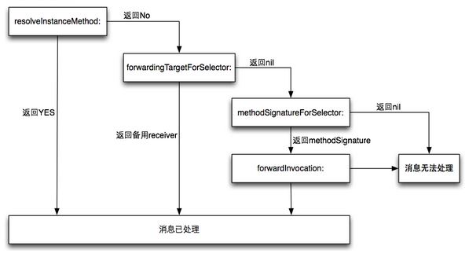

<p align="center">


</p>

## 序言

> Debugging has a rather bad reputation. I mean, if the developer had a complete understanding of the program, there wouldn’t be any bugs and they wouldn’t be debugging in the first place, right?<br/>Don’t think like that.<br/>There are always going to be bugs in your software — or any software, for that matter. No amount of test coverage imposed by your product manager is going to fix that. In fact, viewing debugging as just a process of fixing something that’s broken is actually a poisonous way of thinking that will mentally hinder your analytical abilities.<br/>Instead, you should view debugging **as simply a process to better understand a program**. It’s a subtle difference, but if you truly believe it, any previous drudgery of debugging simply disappears.

从 **Cobol** 语言的创始人 Grace Hopper 在继电器式计算机中发现世界上第一个 Bug 开始，软件开发中 Bug 的产生就从未停止，正如《Advanced Apple Debugging & Reverse Engineering》一书前言所述：开发者不要妄图认为如果能充分了解软件的工作方式，就不会存在 Bug，事实上，任何软件中都存在 Bug。所以在软件开发周期中，Debugging 几乎是一个无法避免的环节。

## 调试概述

如果你问一个经验不丰富的程序该如何定义调试，他也许会回答你调试就是找出解决问题的方案。事实上，这只是调试中目标的一小部分，甚至都不算是最重要的一部分。
有效的调试需要如下步骤：

1. 找出为什么软件没有按照期望的行为运行
2. 解决问题
3. 避免引发其他问题
4. 提升代码的整体质量，包括可读性、架构、测试覆盖率、性能等方面
5. 确保类似问题不会再其他地方再次出现

在上面步骤中，最重要是第一步——找出导致问题的根源，这是后面其他步骤的先决条件。

研究表明经验丰富的程序员调试找出 Bug 的所用的时间大约是缺乏经验的程序员的 1/20。经验丰富的程序员与缺乏经验的程序员直接存在巨大的调试效率的差异。不幸的是，有很多关于软件设计的书籍，但却深入讲调试这块的比较少，学校的课程中几乎也看不到关于调试的内容。

这些年来，调试器在不断在发展，也彻底改变了程序员们的编程方式。当然调试器无法代替良好的思维，思维也无法替代优秀的调试器，最完美的组合就是优秀的调试器加上良好的思维。

下图是《调试九法:软硬件错误的排查之道》一书提及的九大调试规则。
<p align="center">


</p>

## 案例

文章通过一个真实的“案例故事”来描述调试过程，有些细节被我改动了，以便保护个人隐私。

### 问题

故事发生我在做登录 SDK 开发的过程中，产线接到用户反馈，在点击登录页面的 QQ 图标的时候出现应用闪退的情况，试图重现的过程中发现是在用户手机未安装 QQ 的情况下，使用 QQ 登录的时候回去拉起 QQ Web 授权页，但此时会出现 `[TCWebViewController setRequestURLStr:]` 找不到 selector 的情况。

> 注意：为了更好的讲解，下面所有涉及到具体业务，与本主题无关的地方没有列出来，同时应用名称用 **AADebug** 代替。

应用崩溃的堆栈信息如下：

```
Terminating app due to uncaught exception 'NSInvalidArgumentException', reason: '-[TCWebViewController setRequestURLStr:]: unrecognized selector sent to instance 0x7fe25bd84f90'
*** First throw call stack:
(
	0   CoreFoundation                      0x0000000112ce4f65 __exceptionPreprocess + 165
	1   libobjc.A.dylib                     0x00000001125f7deb objc_exception_throw + 48
	2   CoreFoundation                      0x0000000112ced58d -[NSObject(NSObject) doesNotRecognizeSelector:] + 205
	3   AADebug                             0x0000000108cffefc __ASPECTS_ARE_BEING_CALLED__ + 6172
	4   CoreFoundation                      0x0000000112c3ad97 ___forwarding___ + 487
	5   CoreFoundation                      0x0000000112c3ab28 _CF_forwarding_prep_0 + 120
	6   AADebug                             0x000000010a663100 -[TCWebViewKit open] + 387
	7   AADebug                             0x000000010a6608d0 -[TCLoginViewKit loadReqURL:webTitle:delegate:] + 175
	8   AADebug                             0x000000010a660810 -[TCLoginViewKit openWithExtraParams:] + 729
	9   AADebug                             0x000000010a66c45e -[TencentOAuth authorizeWithTencentAppAuthInSafari:permissions:andExtraParams:delegate:] + 701
	10  AADebug                             0x000000010a66d433 -[TencentOAuth authorizeWithPermissions:andExtraParams:delegate:inSafari:] + 564
………………………………………………………………………………………………………………………………………………………………………………………………………………………………………………………………………………………………………………………………………………………………………………………………

省略若干无关行	

………………………………………………………………………………………………………………………………………………………………………………………………………………………………………………………………………………………………………………………………………………………………………………………………
236
	14  libdispatch.dylib                   0x0000000113e28ef9 _dispatch_call_block_and_release + 12
	15  libdispatch.dylib                   0x0000000113e4949b _dispatch_client_callout + 8
	16  libdispatch.dylib                   0x0000000113e3134b _dispatch_main_queue_callback_4CF + 1738
	17  CoreFoundation                      0x0000000112c453e9 __CFRUNLOOP_IS_SERVICING_THE_MAIN_DISPATCH_QUEUE__ + 9
	18  CoreFoundation                      0x0000000112c06939 __CFRunLoopRun + 2073
	19  CoreFoundation                      0x0000000112c05e98 CFRunLoopRunSpecific + 488
	20  GraphicsServices                    0x0000000114a13ad2 GSEventRunModal + 161
	21  UIKit                               0x0000000110d3f676 UIApplicationMain + 171
	22  AADebug                             0x0000000108596d3f main + 111
	23  libdyld.dylib                       0x0000000113e7d92d start + 1
)
libc++abi.dylib: terminating with uncaught exception of type NSException
```

### 消息转发

在调试之前，准备用一些篇幅讲解 Objective-C 中的消息转发（message forwarding）机制。当运行时期间对象接收到无法解读的对象后，就会开启消息转发机制，由程序员来告诉对象应该如何处理这条未知消息。

消息转发中通常会涉及到下面四个方法：

1. `+ (BOOL)resolveInstanceMethod:(SEL)sel`：对象收到未知消息后，首先会调用该方法，参数就是未知消息的 selector，返回值则表示能否新增一个实例方法处理 selector 参数。如果这一步成功处理了 selector 后，返回 `YES`，后续的转发机制不在进行。事实上，这个被经常使用在要访问 **CoreData** 框架中的 NSManagedObjects 对象的属性时。<br/>`+ (BOOL)resolveClassMethod:(SEL)sel`：和上面方法类似，区别就是上面是实例方法，这个是类方法。
2. `- (id)forwardingTargetForSelector:(SEL)aSelector`：这个方法提供处理未知消息的备援接受者，这个比 `forwardInvocation:` 标准转发机制更快。通常可以这个方案来模拟多继承的某些特性。
3. `- (NSMethodSignature *)methodSignatureForSelector:(SEL)aSelector`：如果消息转发的算法执行到这一步，代表以及开启了完整的消息转发机制，这个方法返回 `NSMethodSignature` 对象，其中包含了指定 selector 参数中的有关方法的描述，在消息转发流程中，如果需要创建 `NSInvocation` 对象也需要重写这个方法。
4. `- (void)forwardInvocation:(NSInvocation *)anInvocation`：方法的实现通常需要完成以下任务：找出能够处理 `anInvocation` 对象封装的消息的对象；使用 `anInvocation` 给前面找出的对象发送消息，`anInvocation` 会保存返回值，运行时会将返回值发送给原来的 sender。

通常将1和2的消息转发称为 **Fast Forwarding**，它提供了一种更为简便的方式进行消息转发，而为了与 **Fast Forwarding** 区分，3和4的消息转发被称之为 Normal Forwarding 或者 Regular Forwarding。 Normal Forwarding 因为要创建 **NSInvocation** 对象，所以更慢一些。

> 注意：如果 `methodSignatureForSelector` 方法返回的 `NSMethodSignature` 是 nil 或者根本没有重写 `methodSignatureForSelector`，则 `forwardInvocation` 不会被执行，消息转发流程终止，抛出无法处理的异常，这个在下文 `___forwarding___`函数的源码中可以看出。

下面的流程图阐述了消息转发的流程

<p align="center">



</p>

### 调试过程

根据上面出错信息中的 `TCWebViewController` 很自然想到与腾讯的 SDK **TencentOpenAPI.framework** 有关，但是产线的应用出现问题的时间段内没有更新腾讯的 SDK，所以应该不是直接由 **TencentOpenAPI.framework** 导致应用崩溃的。

首先通过反编译工具拿到 `TCWebViewController` 类的结构

```
  ; @class TCWebViewController : UIViewController<UIWebViewDelegate, NSURLConnectionDelegate, NSURLConnectionDataDelegate> {
                                       ;     @property webview
                                       ;     @property webTitle
                                       ;     @property requestURLStr
                                       ;     @property error
                                       ;     @property delegate
                                       ;     @property activityIndicatorView
                                       ;     @property finished
                                       ;     @property theData
                                       ;     @property retryCount
                                       ;     @property hash
                                       ;     @property superclass
                                       ;     @property description
                                       ;     @property debugDescription
                                       ;     ivar _nloadCount
                                       ;     ivar _webview
                                       ;     ivar _webTitle
                                       ;     ivar _requestURLStr
                                       ;     ivar _error
                                       ;     ivar _delegate
                                       ;     ivar _xo
                                       ;     ivar _activityIndicatorView
                                       ;     ivar _finished
                                       ;     ivar _theData
                                       ;     ivar _retryCount
                                       ;     -setError:
                                       ;     -initWithNibName:bundle:
                                       ;     -dealloc
                                       ;     -stopLoad
                                       ;     -doClose
                                       ;     -viewDidLoad
                                       ;     -loadReqURL
                                       ;     -viewDidDisappear:
                                       ;     -shouldAutorotateToInterfaceOrientation:
                                       ;     -supportedInterfaceOrientations
                                       ;     -shouldAutorotate
                                       ;     -webViewDidStartLoad:
                                       ;     -webViewDidFinishLoad:
                                       ;     -webView:didFailLoadWithError:
                                       ;     -webView:shouldStartLoadWithRequest:navigationType:
                                       ; }
                     _OBJC_CLASS_$_TCWebViewController:
```

静态分析的结果发现 `TCWebViewController` 类中确实没有 `requestURLStr` 的 Setter 和 Getter，因为之前版本没有出现崩溃。

此时产生一个想法：`TCWebViewController` 类中的 Property 会不会像 **Core Data** 框架一样，使用 `@dynamic` 告诉编译器不做处理，然后 Getter 和 Setter 方法是在运行时动态创建。于是带着这个猜想继续查下去，发现在 **TencentOpenAPI.framework** 中有个 `NSObject` 的 Category：`NSObject(MethodSwizzlingCategory)` 非常可疑，其中 `switchMethodForCodeZipper:` 方法分别将消息转发过程中的 `methodSignatureForSelector` 和 `forwardInvocation`方法替换为 `QQmethodSignatureForSelector` 和 `QQforwardInvocation`。

```objective-c
void +[NSObject switchMethodForCodeZipper](void * self, void * _cmd) {
    rbx = self;
    objc_sync_enter(self);
    if (*(int8_t *)_g_instance == 0x0) {
            [NSObject swizzleMethod:@selector(methodSignatureForSelector:) withMethod:@selector(QQmethodSignatureForSelector:)];
            [NSObject swizzleMethod:@selector(forwardInvocation:) withMethod:@selector(QQforwardInvocation:)];
            *(int8_t *)_g_instance = 0x1;
    }
    rdi = rbx;
    objc_sync_exit(rdi);
    return;
}
```

于是将视线转移到 `QQmethodSignatureForSelector` 中，发现在其中有个方法：`_AddDynamicPropertysSetterAndGetter`，从方法名称很容易知道这个方法是动态地给属性添加 Setter 和 Getter 方法。基本验证了 `TCWebViewController` 类中的 Property 的 Setter 和 Getter 方法是在 Runtime 动态添加。

```objective-c
void * -[NSObject QQmethodSignatureForSelector:](void * self, void * _cmd, void * arg2) {
    r14 = arg2;
    rbx = self;
    rax = [self QQmethodSignatureForSelector:rdx];
    if (rax == 0x0) {
            rax = sel_getName(r14);
            _AddDynamicPropertysSetterAndGetter();
            rax = 0x0;
            if (0x0 != 0x0) {
                    rax = [rbx methodSignatureForSelector:r14];
            }
    }
    return rax;
}
```

那究竟为什么 `TCWebViewController` 找不到 Setter 的 Selector 呢？是否在开发新版本的过程覆盖了 `QQMethodSignatureForSelector` 导致的呢？然而在搜遍项目的所有角落，并没有发现项目中替换有 `NSObject` 的 `methodSignatureForSelector`，问题有点棘手，分析到这一步，静态分析暂时告一段落，下一步将使用 LLDB 来动态调试腾讯的三方库，从而找出是哪一个环节破坏了消息转发过程中动态生成 Getter 和 Setter。

> 这里其实如果通过 LLDB 命令给 `setRequestURLStr` 方法打断点，会发现不能成功打上这个断点，原因也是因为 Setter 方法其实在编译时还没有，也能作为上面猜想的佐证。

根据崩溃堆栈中可以推测出 `setRequestURLStr` 是在 `-[TCWebViewKit open]` 方法中调用的，也就是腾讯的 SDK 发现没有安装 QQ 时，会打开 QQ 的 Web 授权页。

我们使用 LLDB 在这个方法下断点，命令如下：

```
br s -n "-[TCWebViewKit open]"
```

断点成功打上。

```
Breakpoint 34: where = AADebug`-[TCWebViewKit open], address = 0x0000000103157f7d
```

当应用准备跳到 Web 授权页的时候，断点会被断住，会看到下图

<p align="center">


</p>

> 案例给出的是在模拟器中运行的截图，所以汇编代码是 X64 的，真机上看到的汇编代码是 ARM 汇编，但是分析的方法都是一样的，这点读者需要注意。

在下图 96 行的汇编代码打一个断点，这条汇编代码就是调用 `setRequestURLStr` 方法，然后打印出 `rbx` 寄存器的内容，可以观察到 `rbx` 寄存器保存的就是 `TCWebViewController` 实例。

<p align="center">


</p>

#### methodSignatureForSelector

接下来用 LLDB 给 `QQmethodSignatureForSelector` 方法下断点

```
br s -n "-[NSObject QQmethodSignatureForSelector:]"
```

LLDB 中输入 `c` 命令让端点继续执行，这个时候断点断在了 `QQmethodSignatureForSelector` 方法内部，所以推翻了 `QQmethodSignatureForSelector` 方法被我们项目替换的猜想。
<p align="center">


</p>

在 `QQmethodSignatureForSelector` 方法汇编代码的最后，也就是31行的 `retq` 指令处下一个断点，然后将寄存器 `rax` 存放的内存地址打印出来，如下图

<p align="center">


</p>

图中在方法返回的时候，将 `rax` 寄存器存放的内存地址 `0x00007fdb36d38df0` 打印出来的结果是一个 `NSMethodSignature` 对象，熟悉 X86 汇编语言调用约定的读者应该知道在 X86 汇编中，函数的返回值存放在 `rax` 寄存器中。结果表明腾讯的 `QQmethodSignatureForSelector` 方法正确被调用了，并且有返回值。所以排除了这一步出现问题。

#### forwardInvocation

使用 LLDB 给 `QQforwardInvocation` 方法下断点

```
br s -n "-[NSObject QQforwardInvocation:]"
```

断点成功添加后，继续运行后，此时应用会崩溃，没有执行 `QQforwardInvocation` 方法，所以基本能够断定是我们项目中覆盖了腾讯 Hook 的 `QQforwardInvocation` 方法。

<p align="center">


</p>

`___forwarding___` 函数包含了消息转发的完整实现，反编译的代码摘自[Objective-C 消息发送与转发机制原理](http://yulingtianxia.com/blog/2016/06/15/Objective-C-Message-Sending-and-Forwarding/)一文，文中反编译代码中调用 `forwardingTargetForSelector` 时判断 forwarding 和 receiver 是否相等处应该写错了，应当是判断 forwardingTarget 和 receiver 是否相等，代码如下：

```
int __forwarding__(void *frameStackPointer, int isStret) {
  id receiver = *(id *)frameStackPointer;
  SEL sel = *(SEL *)(frameStackPointer + 8);
  const char *selName = sel_getName(sel);
  Class receiverClass = object_getClass(receiver);

  // 调用 forwardingTargetForSelector:
  if (class_respondsToSelector(receiverClass, @selector(forwardingTargetForSelector:))) {
    id forwardingTarget = [receiver forwardingTargetForSelector:sel];
    if (forwardingTarget && forwardingTarget != receiver) {
    	if (isStret == 1) {
    		int ret;
    		objc_msgSend_stret(&ret,forwardingTarget, sel, ...);
    		return ret;
    	}
      return objc_msgSend(forwardingTarget, sel, ...);
    }
  }

  // 僵尸对象
  const char *className = class_getName(receiverClass);
  const char *zombiePrefix = "_NSZombie_";
  size_t prefixLen = strlen(zombiePrefix); // 0xa
  if (strncmp(className, zombiePrefix, prefixLen) == 0) {
    CFLog(kCFLogLevelError,
          @"*** -[%s %s]: message sent to deallocated instance %p",
          className + prefixLen,
          selName,
          receiver);
    <breakpoint-interrupt>
  }

  // 调用 methodSignatureForSelector 获取方法签名后再调用 forwardInvocation
  if (class_respondsToSelector(receiverClass, @selector(methodSignatureForSelector:))) {
    NSMethodSignature *methodSignature = [receiver methodSignatureForSelector:sel];
    if (methodSignature) {
      BOOL signatureIsStret = [methodSignature _frameDescriptor]->returnArgInfo.flags.isStruct;
      if (signatureIsStret != isStret) {
        CFLog(kCFLogLevelWarning ,
              @"*** NSForwarding: warning: method signature and compiler disagree on struct-return-edness of '%s'.  Signature thinks it does%s return a struct, and compiler thinks it does%s.",
              selName,
              signatureIsStret ? "" : not,
              isStret ? "" : not);
      }
      if (class_respondsToSelector(receiverClass, @selector(forwardInvocation:))) {
        NSInvocation *invocation = [NSInvocation _invocationWithMethodSignature:methodSignature frame:frameStackPointer];

        [receiver forwardInvocation:invocation];

        void *returnValue = NULL;
        [invocation getReturnValue:&value];
        return returnValue;
      } else {
        CFLog(kCFLogLevelWarning ,
              @"*** NSForwarding: warning: object %p of class '%s' does not implement forwardInvocation: -- dropping message",
              receiver,
              className);
        return 0;
      }
    }
  }

  SEL *registeredSel = sel_getUid(selName);

  // selector 是否已经在 Runtime 注册过
  if (sel != registeredSel) {
    CFLog(kCFLogLevelWarning ,
          @"*** NSForwarding: warning: selector (%p) for message '%s' does not match selector known to Objective C runtime (%p)-- abort",
          sel,
          selName,
          registeredSel);
  } // doesNotRecognizeSelector
  else if (class_respondsToSelector(receiverClass,@selector(doesNotRecognizeSelector:))) {
    [receiver doesNotRecognizeSelector:sel];
  } 
  else {
    CFLog(kCFLogLevelWarning ,
          @"*** NSForwarding: warning: object %p of class '%s' does not implement doesNotRecognizeSelector: -- abort",
          receiver,
          className);
  }

  // The point of no return.
  kill(getpid(), 9);
}
```

通过阅读反编译代码，基本能将消息转发的流程梳理清楚，首先是调用消息转发流程中的 `forwardingTargetForSelector` 方法获取备援接受者，也就是上文说的 Fast Forwarding 阶段，从代码中可以看出如果 `forwardingTarget` 返回空，或者和 `receiver`，则进入 Regular Forwarding 阶段，具体来说就是先调用 
`methodSignatureForSelector` 拿到方法签名，然后使用前面获取到的方法签名对象和 `frameStackPointer` 实例化 `invocation` 对象，调用 `receiver` 的 `forwardInvocation:` 方法，并将刚才实例化的 `invocation` 对象传入。最后如果没有实现 `methodSignatureForSelector` 方法并且 `selector` 已经在 Runtime 注册过了，则调用 `doesNotRecognizeSelector:` 抛出异常。

观察我们项目中崩溃堆栈中的 `___forwarding___`，会发现他的执行路径是第二步，也就是调用了 `forwardInvocation` 执行 `NSInvocation` 对象。

> 也可以在断点之后逐步执行命令，观察汇编代码的执行路径，得出结论与上面应该是一致的。

<p align="center">


</p>

然而调用 `forwardInvocation` 方法究竟执行了哪个方法呢，从堆栈中我们可以看到 `__ASPECTS_ARE_BEING_CALLED__` 方法，这个是 `Aspects` 库 Hook `forwardInvocation` 的方法。

```objective-c
static void aspect_swizzleForwardInvocation(Class klass) {
    NSCParameterAssert(klass);
    // If there is no method, replace will act like class_addMethod.
    IMP originalImplementation = class_replaceMethod(klass, @selector(forwardInvocation:), (IMP)__ASPECTS_ARE_BEING_CALLED__, "v@:@");
    
    if (originalImplementation) {
        class_addMethod(klass, NSSelectorFromString(AspectsForwardInvocationSelectorName), originalImplementation, "v@:@");
    }
    AspectLog(@"Aspects: %@ is now aspect aware.", NSStringFromClass(klass));
}
```

```objective-c
// This is the swizzled forwardInvocation: method.
static void __ASPECTS_ARE_BEING_CALLED__(__unsafe_unretained NSObject *self, SEL selector, NSInvocation *invocation) {
    NSLog(@"selector:%@",  NSStringFromSelector(invocation.selector));
    NSCParameterAssert(self);
    NSCParameterAssert(invocation);
    SEL originalSelector = invocation.selector;
	SEL aliasSelector = aspect_aliasForSelector(invocation.selector);
    invocation.selector = aliasSelector;
    AspectsContainer *objectContainer = objc_getAssociatedObject(self, aliasSelector);
    AspectsContainer *classContainer = aspect_getContainerForClass(object_getClass(self), aliasSelector);
    AspectInfo *info = [[AspectInfo alloc] initWithInstance:self invocation:invocation];
    NSArray *aspectsToRemove = nil;

    // Before hooks.
    aspect_invoke(classContainer.beforeAspects, info);
    aspect_invoke(objectContainer.beforeAspects, info);

    // Instead hooks.
    BOOL respondsToAlias = YES;
    if (objectContainer.insteadAspects.count || classContainer.insteadAspects.count) {
        aspect_invoke(classContainer.insteadAspects, info);
        aspect_invoke(objectContainer.insteadAspects, info);
    }else {
        Class klass = object_getClass(invocation.target);
        do {
            if ((respondsToAlias = [klass instancesRespondToSelector:aliasSelector])) {
                [invocation invoke];
                break;
            }
        }while (!respondsToAlias && (klass = class_getSuperclass(klass)));
    }

    // After hooks.
    aspect_invoke(classContainer.afterAspects, info);
    aspect_invoke(objectContainer.afterAspects, info);

    // If no hooks are installed, call original implementation (usually to throw an exception)
    if (!respondsToAlias) {
        invocation.selector = originalSelector;
        SEL originalForwardInvocationSEL = NSSelectorFromString(AspectsForwardInvocationSelectorName);
        if ([self respondsToSelector:originalForwardInvocationSEL]) {
            ((void( *)(id, SEL, NSInvocation *))objc_msgSend)(self, originalForwardInvocationSEL, invocation);
        }else {
            [self doesNotRecognizeSelector:invocation.selector];
        }
    }

    // Remove any hooks that are queued for deregistration.
    [aspectsToRemove makeObjectsPerformSelector:@selector(remove)];
}
```

因为 `TCWebViewController` 是腾讯 SDK 中的私有类，猜想项目不大可能直接对其进行 Hook，很有可能是 Hook 了一个父类导致这个子类也受到影响，于是在项目中继续排查。啊哈！答案终于浮出水面。将 Hook `UIViewController` 的部分删除或者注释，此时再去使用 QQ 登录，应用不再崩溃。于是初步断定是 Aspects 库导致的。

<p align="center">


</p>

`doesNotRecognizeSelector:` 是从 `__ASPECTS_ARE_BEING_CALLED__` 方法抛出来的，`__ASPECTS_ARE_BEING_CALLED__` 是 **Aspects** 用来替换 `forwardInvocation:` 的 IMP，方法内部包含了 before、instead、after 对应时间 Aspects 切片的 hook 的逻辑。`aliasSelector` 是 **Aspects** 处理后的 SEL，如`aspects__setRequestURLStr:`。

在 Instead hooks 部分会检查 `invocation.target` 的类是否能响应 `aliasSelector`，如果子类不能响应，再检查父类是否响应，一直往上寻找直到 root，由于不能响应 `aliasSelector`，所以 `respondsToAlias` 为 false。随后，则会去将 `originalSelector` 赋值给 `invocation` 的 `selector`, 再通过 `objc_msgSend` 调用 `invocation`，企图去调用原始的 SEL，由于 `TCWebViewController` 原本就无法响应 `originalSelector`:`setRequestURLStr:`，Setter 方法本身就是在 Runtime 生成的，所以最终会运行到 `__ASPECTS_ARE_BEING_CALLED__` 方法中的 `doesNotRecognizeSelector:` 方法，也就会出现上文所述的崩溃的情况。

#### 解决方案

要修复这个问题其实有两种思路，第一种思路，使用一种侵入性更小的 hook 方案来替换 **Aspects**，比如 Method Swizzling，这样就不会出现 **TencentOpenAPI** 生成 `Setter` 方法的消息转发流程被打断；第二种思路，**Aspects** 是直接将 `forwardInvocation:` 替换成自己实现，如果 `aliasSelector` 和 `originalSelector` 都无法响应时抛出异常，可以采取一种更合理的处理方式，如果出现上面的情况，将消息转发流程调回到原始的转发流程中，代码如下：

```objective-c
     if (!respondsToAlias) {
          invocation.selector = originalSelector;
          SEL originalForwardInvocationSEL = NSSelectorFromString(AspectsForwardInvocationSelectorName);
         ((void( *)(id, SEL, NSInvocation *))objc_msgSend)(self, originalForwardInvocationSEL, invocation);
      }
```

事实上，除了我们遇到的问题，**Aspects** 与 **JSPatch** 也存在兼容问题，由于两者的实现原理也类似，也会出现本文中遇到的 `doesNotRecognizeSelector:`，具体请阅读[微信读书的文章](http://wereadteam.github.io/2016/06/30/Aspects/)。笔者也逛了下 **Aspects** 与 **JSPatch** 的 Issues，也有相关两者兼容问题相关的信息。

#### Aspects 与 TencentOpenAPI 的一次完美邂逅

导致崩溃的原因是 **Aspects** 与 **TencentOpenAPI** 两个库的一次完美邂逅。项目中使用 Aspects 库 Hook `UIViewController` 类的页面生命周期方法，Aspects 的 Hook 实现会替换掉 `forwardInvocation` 方法，由于 `TCWebViewController` 的父类是 `UIViewController`，所以也会被 Hook 住，`QQforwardInvocation` 方法被覆盖，导致消息转发失败，从而无法动态生成属性的 Setter 和 Getter 方法。

上面案例给了我们一个警示，在使用一个第三方框架和技术的时候，我们不应该值停留在会使用的层面上，而是要深入了解他背后的工作原理。这样定位问题时才会事半功倍。

## 参考资料

* 《Advanced Apple Debugging & Reverse Engineering》
* 《调试九法:软硬件错误的排查之道》
* [Objective-C 消息发送与转发机制原理](http://yulingtianxia.com/blog/2016/06/15/Objective-C-Message-Sending-and-Forwarding/)

## 致谢

特别致谢以下读者对文章支持，并对文章提出了非常有价值的建议

* [ZenonHuang](https://github.com/ZenonHuang)