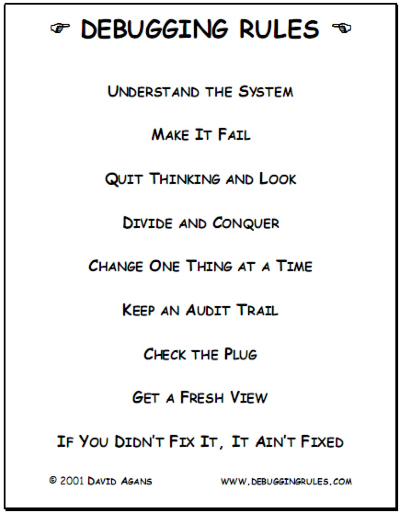
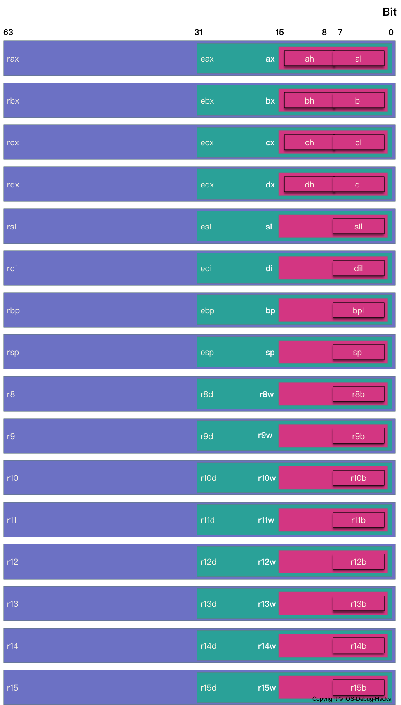
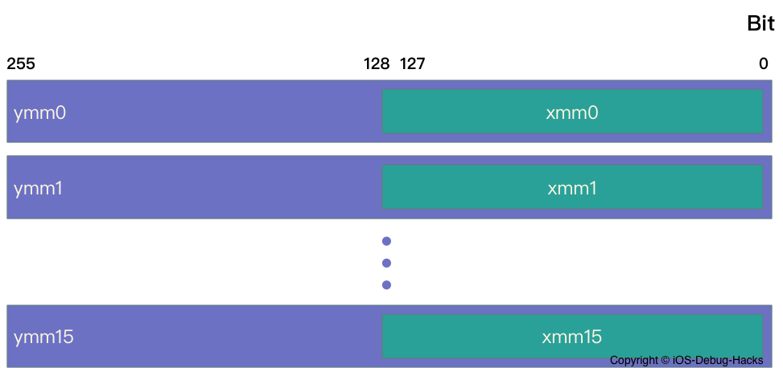
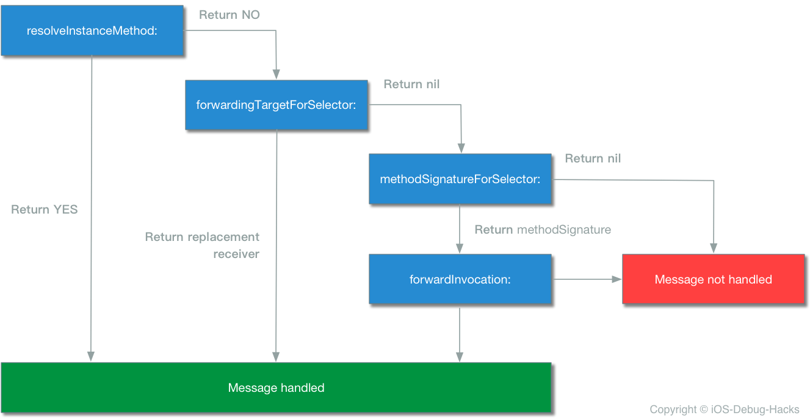

<p align="center">


</p>

[中文](README_CN.md)

## Preface

> Debugging has a rather bad reputation. I mean, if the developer had a complete understanding of the program, there wouldn’t be any bugs and they wouldn’t be debugging in the first place, right?<br/>Don’t think like that.<br/>There are always going to be bugs in your software — or any software, for that matter. No amount of test coverage imposed by your product manager is going to fix that. In fact, viewing debugging as just a process of fixing something that’s broken is actually a poisonous way of thinking that will mentally hinder your analytical abilities.<br/>Instead, you should view debugging **as simply a process to better understand a program**. It’s a subtle difference, but if you truly believe it, any previous drudgery of debugging simply disappears.

Since Grace Hopper, the founder of the **Cobol** language, discovered the world's first Bug in a relay computer, the generation of Bug in software development has never stopped. As the preface to the book of《Advanced Apple Debugging & Reverse Engineering》tells us: Developers don't want to think that if there is a good understanding of how software works, there will be no Bug. Therefore, debugging is almost an inevitable phase in the software development life cycle.

## Debugging Overview

If you ask an inexperienced programmer
 about how to define debugging, he might say "Debugging is something you do to find a solution for your software problem". He is right, but that's just a tiny part of a real debugging.

Here are the steps of a real debugging:
1. Find out why it's behaving unexpectedly
2. Resolve it
3. Try to make sure no new issue is involved
4. Improve the quality of your code, include readability, architecture, test coverage and performance etc.
5. Make sure that the same problem does not occur anywhere else

Among above steps, the most important step is the first step: find out the problem. Apparently, it's a prerequisite of other steps.

Research shows the time experienced programmers spend on debugging to locate the same set of defects is about one twentieth of inexperienced programmers. That means debugging experience makes an enormous difference in programming efficiency. We have lots of books on software design, unfortunately, rare of them have introduction about debugging, even the courses in school.

As the debugger improving over the years, the programmers' coding style is changed thoroughly. Of course, the debugger can not replace the good thinking, thinking can not replace the excellent debugger, the most perfect combination is excellent debugger with good thinking.

The following graph is the nine debugging rules described in book <Debugging: The 9 Indispensable Rules for Finding Even the Most Elusive Software and Hardware Problems>.

<p align="center">



</p>

## Assembly Language

> Although as an iOS programmer, most of the time in the work will not deal with the assembly language, but understand the assembly is still very helpful, especially when debugging a system framework or a third-party framework without the source code.

Asssembly Language is a low-level machine-oriented programming language, which can be thought of as a collection of mnemonics for machine instructions for various CPUs. Programmers can use assembly language to control the computer hardware system directly. and the program written in assembly language have many merits, like fast execution speed and less memory occupied.

So far, two major architectures are widely used on the Apple platform, x86 and ARM. In the mobile device using the ARM assembly language, which is mainly because the ARM is a reduced instruction set computing (RISC) architecture, with low power consumption advantage. While the desktop platform like Mac OS, x86 architecture is used. The Apps installed on iOS simulators is actually running as a Mac OS App inside the simulator, which means simulator is working like a container. Since our case was debugged in the iOS simulators, the main research goal is **x86** assembly language.

### AT&T and Intel

x86 assembly language evolves into two syntax branches: Intel (orignially used in the x86 platform documentation) and AT&T. Intel dominates the MS-DOS and Windows family, while AT&T is common in UNIX family. There is a huge difference on syntax between Intel and AT&T, like variable, constant, the access of registers, indirect addressing and offset. Although their syntax difference is enormous, the hardware system is the same which means one of them can be migrated to the other seamlessly. Since AT&T assembly language is used on Xcode, we will focus on **AT&T** in below part.

> Please notice that Intel syntax is used on 
the disassembly tools of Hopper Disassemble and IDA Pro.

Belows are the differences between Intel and AT&T:
1. The prefix of operand: In AT&T syntax, `%` is used as the prefix of registers' name and `$` is used as the prefix of immediate operand, while no prefix is used for both registers and immediate operand in Intel. The other difference is `0x` is added as the prefix for hexadecimal in AT&T. The chart below demonstrates the difference between their prefixes:

	| AT&T | Intel |
	|:-------:|:-------:|
	| movq %rax, %rbx | mov rbx, rax |
	| addq $0x10, %rsp | add rsp, 010h |

> In Intel syntax, `h` suffix is used for hexadecimal operand and `b` suffix is used for binary operand.

2. Operand: In AT&T syntax, the first operand is source operand, the second operand is destination operand. However, in Intel syntax, the order of operand is opposite. From this point, the syntax of AT&T is more comfortable for us according to our reading habit.
3. Addressing Mode: Comparing with Intel syntax, the indirect addressing mode of AT&T is hard to read. However, the algorithm of address calculation is the same: `address = disp + base + index * scale`. `base` represents the base address, `disp` stands for offset address, `index * scale` determines the location of an element, `scale` is the size of an element which can only be a power of two. `disp/base/index/scale` are all optional, the default value of `index` is 0, while the default value of `scale` is 1. Now let's see the instruction of address calculation: `%segreg: disp(base,index,scale)` is for AT&T, and `segreg: [base+index*scale+disp]` is for Intel. In fact, above two instructions both belong to segment addressing mode. `segreg` stands for segment register which is usually used in real mode when the digit capacity of CPU addressing beyonds the register' digit. For example, CPU can address 20-bit space, but the register only has 16-bit. To achieve 20-digit space, another addressing mode needs to be used: `segreg:offset`. With this addressing mode, the offset address will be `segreg * 16 + offset`, but it's more complicated than flat memory mode. In protect mode, the addressing is under linear address space, which means segment base address can be ignored.

	| AT&T | Intel |
	|:-------:|:-------:|
	| movq 0xb57751(%rip), %rsi | mov rsi, qword ptr [rip+0xb57751h] |
	| leaq (%rax,%rbx,8), %rdi | lea rdi, qword ptr [rax+rbx*8] |
	
> If immediate operand comes at the place of `disp` or `scale`, `$` suffix can be omitted. In Intel syntax, `byte ptr`, `word ptr`, `dword ptr` and `qword ptr` need to be added before the memory operand.

4. Suffix of opcode: In AT&T syntax, all opcodes have a suffix to specify the size. There are generally four kinds of suffixes:`b`,`w`,`l` and `q`. `b`represents 8-bit byte, `w` means 16-bit word, `l` means 32-bit double word. 32-digit word is also called as long word which is from the 16-bit days. `q` represents 64-bit quadword. The chart below illustrates the syntax of data transition instruction(mov) in AT&T and Intel.

	| AT&T | Intel |
	|:-------:|:-------:|
	| movb %al, %bl | mov bl, al |
	| movw %ax, %bx | mov bx, ax |
	| movl %eax, %ebx | mov ebx, eax |
	| movq %rax, %rbx | mov rbx, rax |

### Register

As we know, Memory is used to store instructions and data for CPU. Memory is essentially an array of bytes. Although the speed of memory access is very fast, we still need a smaller and faster storage unit to speed up the CPU's instruction execution, which is register. During the instruction execution, all data are temporarily stored in registers. That's why register is named in.

When processors grows from 16-bit to 32-bit, 8 registers are extended to 32-bit too. After that, when the extended registers are used, `E` prefix is added to the original register name. 32-bit processor is Intel Architecture 32-bit, which is IA32. Today, the main processors are 64-bit Intel architecture, which is extended from IA32 and been called x86-64. Since IA32 is past, this article will only focus on x86-64. Note that in x86-64, the amount of registers is extended from 8 to 16. Just because of this extension, the program state can be stored in registers but not stacks. Thus, the frequency of memory access is hugely reduced.

In x86-64, there are 16 64-bit general registers and 16 floating pointer registers. Besides, CPU has one more 64-bit instruction pointer register called `rip`. It is designed to store the address of the next executed instruction. There are also some other registers which are not widely used, we don't intend to talk about them in this article. Among the 16 general registers, eight of them are from the IA32: rax、rcx、rdx、rbx、rsi、rdi、rsp and rbp. The other eight general registers are new added since x86-64 which are r8 - r15. The 16 floating registers are xmm0 - xmm15.

Current CPUs are from 8088, the register is also extended from 16-bit to 32-bit and finally to 64-bit. Thus, the program can still access the low 8-bit or 16-bit or 32-bit of the registers. 

Below chart illustrates the 16 general registers of x86-64:

<p align="center">



</p>

Using `register read` command in LLDB can dump the register data of current stack frame.

For example, we can use below command to show all the data in the register:

```
register read -a or register read --all
```

```
General Purpose Registers:
       rax = 0x00007ff8b680c8c0
       rbx = 0x00007ff8b456fe30
       rcx = 0x00007ff8b6804330
       rdx = 0x00007ff8b6804330
       rdi = 0x00007ff8b456fe30
       rsi = 0x000000010cba6309  "initWithTask:delegate:delegateQueue:"
       rbp = 0x000070000f1bcc90
       rsp = 0x000070000f1bcc18
        r8 = 0x00007ff8b680c8c0
        r9 = 0x00000000ffff0000
       r10 = 0x00e6f00100e6f080
       r11 = 0x000000010ca13306  CFNetwork`-[__NSCFURLLocalSessionConnection initWithTask:delegate:delegateQueue:]
       r12 = 0x00007ff8b4687c70
       r13 = 0x000000010a051800  libobjc.A.dylib`objc_msgSend
       r14 = 0x00007ff8b4433bd0
       r15 = 0x00007ff8b6804330
       rip = 0x000000010ca13306  CFNetwork`-[__NSCFURLLocalSessionConnection initWithTask:delegate:delegateQueue:]
    rflags = 0x0000000000000246
        cs = 0x000000000000002b
        fs = 0x0000000000000000
        gs = 0x0000000000000000
       eax = 0xb680c8c0
       ebx = 0xb456fe30
       ecx = 0xb6804330
       edx = 0xb6804330
       edi = 0xb456fe30
       esi = 0x0cba6309
       ebp = 0x0f1bcc90
       esp = 0x0f1bcc18
       r8d = 0xb680c8c0
       r9d = 0xffff0000
      r10d = 0x00e6f080
      r11d = 0x0ca13306
      r12d = 0xb4687c70
      r13d = 0x0a051800
      r14d = 0xb4433bd0
      r15d = 0xb6804330
        ax = 0xc8c0
        bx = 0xfe30
        cx = 0x4330
        dx = 0x4330
        di = 0xfe30
        si = 0x6309
        bp = 0xcc90
        sp = 0xcc18
       r8w = 0xc8c0
       r9w = 0x0000
      r10w = 0xf080
      r11w = 0x3306
      r12w = 0x7c70
      r13w = 0x1800
      r14w = 0x3bd0
      r15w = 0x4330
        ah = 0xc8
        bh = 0xfe
        ch = 0x43
        dh = 0x43
        al = 0xc0
        bl = 0x30
        cl = 0x30
        dl = 0x30
       dil = 0x30
       sil = 0x09
       bpl = 0x90
       spl = 0x18
       r8l = 0xc0
       r9l = 0x00
      r10l = 0x80
      r11l = 0x06
      r12l = 0x70
      r13l = 0x00
      r14l = 0xd0
      r15l = 0x30

Floating Point Registers:
     fctrl = 0x037f
     fstat = 0x0000
      ftag = 0x00
       fop = 0x0000
     fioff = 0x00000000
     fiseg = 0x0000
     fooff = 0x00000000
     foseg = 0x0000
     mxcsr = 0x00001fa1
  mxcsrmask = 0x0000ffff
     stmm0 = {0x00 0x00 0x00 0x00 0x00 0x00 0x00 0x00 0xff 0xff}
     stmm1 = {0x00 0x01 0x00 0x00 0x00 0x00 0x00 0x00 0xff 0xff}
     stmm2 = {0x00 0x00 0x00 0x00 0x00 0x00 0x00 0x00 0x00 0x00}
     stmm3 = {0x00 0x00 0x00 0x00 0x00 0x00 0x00 0x00 0x00 0x00}
     stmm4 = {0x00 0x00 0x00 0x00 0x00 0x00 0xbc 0x87 0x0b 0xc0}
     stmm5 = {0x00 0x00 0x00 0x00 0x00 0x00 0x00 0x00 0x00 0x00}
     stmm6 = {0x00 0x00 0x00 0x00 0x00 0x00 0x78 0xbb 0x0b 0x40}
     stmm7 = {0x00 0x00 0x00 0x00 0x00 0x00 0x00 0x00 0x00 0x00}
      ymm0 = {0x00 0x00 0x00 0x00 0x00 0x00 0x00 0x00 0x00 0x00 0x00 0x00 0x00 0x00 0x00 0x00 0x00 0x00 0x00 0x00 0x00 0x00 0x00 0x00 0x00 0x00 0x00 0x00 0x00 0x00 0x00 0x00}
      ymm1 = {0x00 0x00 0x00 0x00 0x00 0x00 0x00 0x00 0x00 0x00 0x00 0x00 0x00 0x00 0x00 0x00 0x00 0x00 0x00 0x00 0x00 0x00 0x00 0x00 0x00 0x00 0x00 0x00 0x00 0x00 0x00 0x00}
      ymm2 = {0x00 0x00 0x00 0x00 0x00 0x00 0x00 0x00 0x00 0x00 0x00 0x00 0x00 0x00 0x00 0x00 0x00 0x00 0x00 0x00 0x00 0x00 0x00 0x00 0x00 0x00 0x00 0x00 0x00 0x00 0x00 0x00}
      ymm3 = {0x00 0x00 0x00 0x00 0x00 0x00 0x00 0x00 0x00 0x00 0x00 0x00 0x00 0x00 0x00 0x00 0x00 0x00 0x00 0x00 0x00 0x00 0x00 0x00 0x00 0x00 0x00 0x00 0x00 0x00 0x00 0x00}
      ymm4 = {0x00 0x00 0x00 0x00 0x00 0x00 0x00 0x00 0x00 0x00 0x00 0x00 0x00 0x00 0x00 0x00 0x00 0x00 0x00 0x00 0x00 0x00 0x00 0x00 0x00 0x00 0x00 0x00 0x00 0x00 0x00 0x00}
      ymm5 = {0x00 0x00 0x00 0x00 0x00 0x00 0x00 0x00 0x00 0x00 0x00 0x00 0x00 0x00 0x00 0x00 0x00 0x00 0x00 0x00 0x00 0x00 0x00 0x00 0x00 0x00 0x00 0x00 0x00 0x00 0x00 0x00}
      ymm6 = {0x00 0x00 0x00 0x00 0x00 0x00 0x00 0x00 0x00 0x00 0x00 0x00 0x00 0x00 0x00 0x00 0x00 0x00 0x00 0x00 0x00 0x00 0x00 0x00 0x00 0x00 0x00 0x00 0x00 0x00 0x00 0x00}
      ymm7 = {0x00 0x00 0x00 0x00 0x00 0x00 0x00 0x00 0x00 0x00 0x00 0x00 0x00 0x00 0x00 0x00 0x00 0x00 0x00 0x00 0x00 0x00 0x00 0x00 0x00 0x00 0x00 0x00 0x00 0x00 0x00 0x00}
      ymm8 = {0x00 0x00 0x00 0x00 0x00 0x00 0x00 0x00 0x00 0x00 0x00 0x00 0x00 0x00 0x00 0x00 0x00 0x00 0x00 0x00 0x00 0x00 0x00 0x00 0x00 0x00 0x00 0x00 0x00 0x00 0x00 0x00}
      ymm9 = {0x00 0x00 0x00 0x00 0x00 0x00 0x00 0x00 0x00 0x00 0x00 0x00 0x00 0x00 0x00 0x00 0x00 0x00 0x00 0x00 0x00 0x00 0x00 0x00 0x00 0x00 0x00 0x00 0x00 0x00 0x00 0x00}
     ymm10 = {0x00 0x00 0x00 0x00 0x00 0x00 0x00 0x00 0x00 0x00 0x00 0x00 0x00 0x00 0x00 0x00 0x00 0x00 0x00 0x00 0x00 0x00 0x00 0x00 0x00 0x00 0x00 0x00 0x00 0x00 0x00 0x00}
     ymm11 = {0x00 0x00 0x00 0x00 0x00 0x00 0x00 0x00 0x00 0x00 0x00 0x00 0x00 0x00 0x00 0x00 0x00 0x00 0x00 0x00 0x00 0x00 0x00 0x00 0x00 0x00 0x00 0x00 0x00 0x00 0x00 0x00}
     ymm12 = {0x00 0x00 0x00 0x00 0x00 0x00 0x00 0x00 0x00 0x00 0x00 0x00 0x00 0x00 0x00 0x00 0x00 0x00 0x00 0x00 0x00 0x00 0x00 0x00 0x00 0x00 0x00 0x00 0x00 0x00 0x00 0x00}
     ymm13 = {0x00 0x00 0x00 0x00 0x00 0x00 0x00 0x00 0x00 0x00 0x00 0x00 0x00 0x00 0x00 0x00 0x00 0x00 0x00 0x00 0x00 0x00 0x00 0x00 0x00 0x00 0x00 0x00 0x00 0x00 0x00 0x00}
     ymm14 = {0x00 0x00 0x00 0x00 0x00 0x00 0x00 0x00 0x00 0x00 0x00 0x00 0x00 0x00 0x00 0x00 0x00 0x00 0x00 0x00 0x00 0x00 0x00 0x00 0x00 0x00 0x00 0x00 0x00 0x00 0x00 0x00}
     ymm15 = {0x00 0x00 0x00 0x00 0x00 0x00 0x00 0x00 0x00 0x00 0x00 0x00 0x00 0x00 0x00 0x00 0x00 0x00 0x00 0x00 0x00 0x00 0x00 0x00 0x00 0x00 0x00 0x00 0x00 0x00 0x00 0x00}
      xmm0 = {0x00 0x00 0x00 0x00 0x00 0x00 0x00 0x00 0x00 0x00 0x00 0x00 0x00 0x00 0x00 0x00}
      xmm1 = {0x00 0x00 0x00 0x00 0x00 0x00 0x00 0x00 0x00 0x00 0x00 0x00 0x00 0x00 0x00 0x00}
      xmm2 = {0x00 0x00 0x00 0x00 0x00 0x00 0x00 0x00 0x00 0x00 0x00 0x00 0x00 0x00 0x00 0x00}
      xmm3 = {0x00 0x00 0x00 0x00 0x00 0x00 0x00 0x00 0x00 0x00 0x00 0x00 0x00 0x00 0x00 0x00}
      xmm4 = {0x00 0x00 0x00 0x00 0x00 0x00 0x00 0x00 0x00 0x00 0x00 0x00 0x00 0x00 0x00 0x00}
      xmm5 = {0x00 0x00 0x00 0x00 0x00 0x00 0x00 0x00 0x00 0x00 0x00 0x00 0x00 0x00 0x00 0x00}
      xmm6 = {0x00 0x00 0x00 0x00 0x00 0x00 0x00 0x00 0x00 0x00 0x00 0x00 0x00 0x00 0x00 0x00}
      xmm7 = {0x00 0x00 0x00 0x00 0x00 0x00 0x00 0x00 0x00 0x00 0x00 0x00 0x00 0x00 0x00 0x00}
      xmm8 = {0x00 0x00 0x00 0x00 0x00 0x00 0x00 0x00 0x00 0x00 0x00 0x00 0x00 0x00 0x00 0x00}
      xmm9 = {0x00 0x00 0x00 0x00 0x00 0x00 0x00 0x00 0x00 0x00 0x00 0x00 0x00 0x00 0x00 0x00}
     xmm10 = {0x00 0x00 0x00 0x00 0x00 0x00 0x00 0x00 0x00 0x00 0x00 0x00 0x00 0x00 0x00 0x00}
     xmm11 = {0x00 0x00 0x00 0x00 0x00 0x00 0x00 0x00 0x00 0x00 0x00 0x00 0x00 0x00 0x00 0x00}
     xmm12 = {0x00 0x00 0x00 0x00 0x00 0x00 0x00 0x00 0x00 0x00 0x00 0x00 0x00 0x00 0x00 0x00}
     xmm13 = {0x00 0x00 0x00 0x00 0x00 0x00 0x00 0x00 0x00 0x00 0x00 0x00 0x00 0x00 0x00 0x00}
     xmm14 = {0x00 0x00 0x00 0x00 0x00 0x00 0x00 0x00 0x00 0x00 0x00 0x00 0x00 0x00 0x00 0x00}
     xmm15 = {0x00 0x00 0x00 0x00 0x00 0x00 0x00 0x00 0x00 0x00 0x00 0x00 0x00 0x00 0x00 0x00}

Exception State Registers:
    trapno = 0x00000003
       err = 0x00000000
  faultvaddr = 0x000000010bb91000  
```

As we know, there are 16 floating pointer registers in x86-64: xmm0 - xmm15. In fact, there are some other details of it. In the output of `register read -a` command, you may notice that there have stmm and ymm registers besides xmm register group. Here stmm is an alias of st register, and st is a register of FPU(Float Point Unit) in x86 to handle float data. The FPU contains one float pointer register which has eight 80-bit float pointer registers: st0 - st7. We can observe that the stmm register is 80-bit from the output, which can prove the stmm register is st register. xmm is 128-bit register, and ymm register is 256-bit which is an extension of xmm. In fact, xmm register is the low 128-bit of ymm register. Like the eax register is the low 32-bit of rax register. In Pentium III, Intel published an instruction set called SSE(Streaming SIMD Extensions) which is an extension of [MMX](https://zh.wikipedia.org/wiki/MMX). Eight new 128-bit registers(xmm0 - xmm7) are added in SSE. AVX(Advanced Vector Extensions) instruction set is an extension architecture of SSE. Also in AVX, the 128-bit register xmm was extended to 256-bit register ymm. 

<p align="center">



</p>

### Function

A function calling includes parameter passing and control transfer from one compilation unit to another. In function calling procedure, data passing, local variable assignment and release are carried out by stack. And the stacks assigned to a single function calling are called Stack Frame.

> The function calling convention of OS X x86-64 is the same with the convention described in the article: [System V Application Binary Interface AMD64 Architecture Processor Supplement](http://www.ucw.cz/~hubicka/papers/abi/). Therefore you can refer to it if you are interested in it.

#### The Stack Frame

During LLDB debugging, we may use `bt` command to print the stack trace of the current thread, like below:

```
(lldb) bt
* thread #1, queue = 'com.apple.main-thread', stop reason = breakpoint 1.1
  * frame #0: 0x00000001054e09d4 TestDemo`-[ViewController viewDidLoad](self=0x00007fd349558950, _cmd="viewDidLoad") at ViewController.m:18
    frame #1: 0x00000001064a6931 UIKit`-[UIViewController loadViewIfRequired] + 1344
    frame #2: 0x00000001064a6c7d UIKit`-[UIViewController view] + 27
    frame #3: 0x00000001063840c0 UIKit`-[UIWindow addRootViewControllerViewIfPossible] + 61
    // many other frames are ommitted here
```

In fact, `bt` command is workable upon stack frame. The stack frame preserves return address and local variable for functions which can be seen as a context of a function execution. As we know, the heap grows upward, while the stack grows downward which is from large-numbered memory addresses to small-numbered ones. Once a function is called, one standalone stack frame is assigned for the function calling. The rbp register, called as frame pointer, always points to the end of the  latest allocated stack frame (high address). The rsp register, called as stack pointer, always points to the top of the latest allocated stack frame (low address). Below is a chart of frame stack:
<p align="center">


</p>

The left column `Position` is memory address which uses indirect addressing mode. `Content` is the value of the address in `Position` points to. According to the struct of stack frame in above chart, the function calling procedure can be described as several steps as follows:
1. Calling function pushes the parameters on the stack. If there is no parameter, this step can be skipped.
2. Push the first instruction after the function calling onto the stack which is actually the return address.
3. Jump to the start address of the called function and execute.
4. Called function preserves the start  address in %rbp register.
5. Preserve the value in %rsp register to %rbp register, so that %rbp register can point to the stack frame's start address of the called function.
6. Push the called function's register on the stack. This is optional.

Step 2 and 3 actually belong to `call` instruction. In addition, step 4 and step 5 can be described in assembly instruction as follows:

```
TestDemo`-[ViewController viewDidLoad]:
    0x1054e09c0 <+0>:  pushq  %rbp //step 4
    0x1054e09c1 <+1>:  movq   %rsp, %rbp //step 5
```

It's easy to notice that these two steps are along with each function calling. There is another detail of above chart: there is a red area below rsp register, which is called as Red Zone by ABI. It is a reserved and shall not be modified by signal or interrupt handlers. Since it can be modified during function calling, therefore, leaf functions which means those functions that never call other functions can use this area for temporary data. 

```
UIKit`-[UIViewController loadViewIfRequired]:
    0x1064a63f1 <+0>:    pushq  %rbp
    0x1064a63f2 <+1>:    movq   %rsp, %rbp
    0x1064a63f5 <+4>:    pushq  %r15
    0x1064a63f7 <+6>:    pushq  %r14
    0x1064a63f9 <+8>:    pushq  %r13
    0x1064a63fb <+10>:   pushq  %r12
    0x1064a63fd <+12>:   pushq  %rbx
```

Among above instructions, instruction from `0x1064a63f5` to `0x1064a63fd` belong to step 6. There is a kind of registers called function preserve register which means they belong to calling function, but the called function is required to preserve their values. From below assembly instructions, we can see rbx, rsp and r12 - r15 all belong to such registers.

```
    0x1064a6c4b <+2138>: addq   $0x1f8, %rsp              ; imm = 0x1F8 
    0x1064a6c52 <+2145>: popq   %rbx
    0x1064a6c53 <+2146>: popq   %r12
    0x1064a6c55 <+2148>: popq   %r13
    0x1064a6c57 <+2150>: popq   %r14
    0x1064a6c59 <+2152>: popq   %r15
    0x1064a6c5b <+2154>: popq   %rbp
    0x1064a6c5c <+2155>: retq   
    0x1064a6c5d <+2156>: callq  0x106d69e9c               ; symbol stub for: __stack_chk_fail
```

#### Call instruction
The instruction to call a function is `call`, refer to below:

```
call function
```
`function` in the parameter is the procedures in **TEXT** segment. `Call` instruction can split into two steps. The first step is to push the next instruction address of `call` instruction on stack. Here, the next address is actually the return address after the called function is finished. The second step is jump to `function`. `call` instruction is equivalent to below two instructions:

```
push next_instruction
jmp  function
```

Following is the example of `call` instruction in iOS simulator:

```
    0x10915c714 <+68>:  callq  0x1093ca502               ; symbol stub for: objc_msgSend
    0x105206433 <+66>:  callq  *0xb3cd47(%rip)           ; (void *)0x000000010475e800: objc_msgSend
```
Above code shows two usages of `call` instruction. In the first usage, the operand is a memory address which is actually a Symbol Stub of a Mach-O file. It can search the symbol of a function through the dynamical linker. In the second usage, the operand is actually obtained by indirect addressing mode. Furthermore, in AT&T syntax, `*` needs to be added to the immediate operand in the jump/call instruction(or the jumps related with programmer counter) as a prefix.

#### Ret instruction

In general, `ret` instruction is used to return the procedure from the called function to the calling function. This instruction pops the address from the top of stack and jump back to that address and keep executing. In above example, it jumps back to `next_instruction`. Before `ret` instruction is executed, the registers belong to calling function will be poped. This is already mentioned in step 6 of function calling procedure. 

#### Parameter passing and return value

Most of the functions have parameter which can be integer, float, pointer and so on. Besides, functions usually have return value which can indicate the execution result is succeed or failed. In OSX, at most 6 parameters can be passed through registers which are rdi, rsi, rdx, rcx, r8 and r9 in order. How about a function with more than 6 parameters? Of course, this circumstance exists. If this happens, stack can be used to preserve the remaining parameters in reversed order. OSX has eight floating point registers which allow to pass up to 8 float parameters.

About the return value of a function, `rax` register is used to save the integer return value. If the return value is a float, xmm0 - xmm1 registers shall be used. Below chart clearly illustrates the register usage convention during the function calling.

<p align="center">


</p>

`preserved across function calls` indicates whether the register needs to be preserved across function call. We can see that besides rbx, r12 - r15 registers mentioned above, rsp and rbp registers also belong to callee-saved registers. This is because these two registers reserve the important location pointers that point to the program stack. 

Next we'll follow a real example to demonstrate the instructions in a function call. Take the macro `DDLogError` in `CocoaLumberjack` as example. When this macro is called, class method `log:level:flag:context:file:function:line:tag:format:` is called. Following code and instructions are about the call of `DDLogError` and the corresponding assembly instructions:

```
- (IBAction)test:(id)sender {
    DDLogError(@"TestDDLog:%@", sender);
}
```

```
    0x102c568a3 <+99>:  xorl   %edx, %edx
    0x102c568a5 <+101>: movl   $0x1, %eax
    0x102c568aa <+106>: movl   %eax, %r8d
    0x102c568ad <+109>: xorl   %eax, %eax
    0x102c568af <+111>: movl   %eax, %r9d
    0x102c568b2 <+114>: leaq   0x2a016(%rip), %rcx       ; "/Users/dev-aozhimin/Desktop/TestDDLog/TestDDLog/ViewController.m"
    0x102c568b9 <+121>: leaq   0x2a050(%rip), %rsi       ; "-[ViewController test:]"
    0x102c568c0 <+128>: movl   $0x22, %eax
    0x102c568c5 <+133>: movl   %eax, %edi
    0x102c568c7 <+135>: leaq   0x2dce2(%rip), %r10       ; @"\eTestDDLog:%@"
    0x102c568ce <+142>: movq   0x33adb(%rip), %r11       ; (void *)0x0000000102c8ad18: DDLog
    0x102c568d5 <+149>: movq   0x34694(%rip), %rbx       ; ddLogLevel
    0x102c568dc <+156>: movq   -0x30(%rbp), %r14
    0x102c568e0 <+160>: movq   0x332f9(%rip), %r15       ; "log:level:flag:context:file:function:line:tag:format:"
    0x102c568e7 <+167>: movq   %rdi, -0x48(%rbp)
    0x102c568eb <+171>: movq   %r11, %rdi
    0x102c568ee <+174>: movq   %rsi, -0x50(%rbp)
    0x102c568f2 <+178>: movq   %r15, %rsi
    0x102c568f5 <+181>: movq   %rcx, -0x58(%rbp)
    0x102c568f9 <+185>: movq   %rbx, %rcx
    0x102c568fc <+188>: movq   -0x58(%rbp), %r11
    0x102c56900 <+192>: movq   %r11, (%rsp)
    0x102c56904 <+196>: movq   -0x50(%rbp), %rbx
    0x102c56908 <+200>: movq   %rbx, 0x8(%rsp)
    0x102c5690d <+205>: movq   $0x22, 0x10(%rsp)
    0x102c56916 <+214>: movq   $0x0, 0x18(%rsp)
    0x102c5691f <+223>: movq   %r10, 0x20(%rsp)
    0x102c56924 <+228>: movq   %r14, 0x28(%rsp)
    0x102c56929 <+233>: movb   $0x0, %al
    0x102c5692b <+235>: callq  0x102c7d2be               ; symbol stub for: objc_msgSend
```

Since all functions of Objective-C will turn into the invocation of `objc_msgSend` function, so `log:level:flag:context:file:function:line:tag:format:` method finally turn into below codes:

```
objc_msgSend(DDLog, @selector(log:level:flag:context:file:function:line:tag:format:), asynchronous, level, flag, context, file, function, line, tag, format, sender)
```

We already mentioned at most 6 registers can be used for parameter passing. The excess parameters can use stack to do the passing. Since above function has more than 6 parameters, the parameter passing would use both registers and stack. Below two tables describe the detail usage of registers and stack for the parameter passing of `DDLogError` function invocation.

| General Register | value | Parameters | Assembly Instructions | Comment |
|:-------:|:-------:|:-------:|:-------:|:-------:|
| rdi | DDLog | self | 0x102c568eb <+171>: movq   %r11, %rdi | |
| rsi | "log:level:flag:context:file:function:line:tag:format:" | op | 0x102c568f2 <+178>: movq   %r15, %rsi | |
| rdx | 0 | asynchronous | 0x102c568a3 <+99>:  xorl   %edx, %edx | xorl is an exclusive-OR operation. Here it's used to clear the edx register |
| rcx | 18446744073709551615 | level | 0x102c568f9 <+185>: movq   %rbx, %rcx | (DDLogLevelAll or NSUIntegerMax) |
| r8 | 1 | flag | 0x102c568aa <+106>: movl   %eax, %r8d | DDLogFlagError |
| r9 | 0 | context | 0x102c568af <+111>: movl   %eax, %r9d | |

| Stack Frame Offset | Value | Parameters | Assembly Instructions | Comment |
|:-------:|:-------:|:-------:|:-------:|:-------:|
| (%rsp) | "/Users/dev-aozhimin/Desktop/TestDDLog/TestDDLog/ViewController.m" | file | 0x102c56900 <+192>: movq   %r11, (%rsp) | |
| 0x8(%rsp) | "-[ViewController test:]" | function | 0x102c56908 <+200>: movq   %rbx, 0x8(%rsp) | |
| 0x10(%rsp) | 0X22 | line | 0x102c5690d <+205>: movq   $0x22, 0x10(%rsp) | The corresponding invocation of DDLogError is in Line 34 |
| 0x18(%rsp) | 0X0 | tag | 0x102c56916 <+214>: movq   $0x0, 0x18(%rsp) | nil |
| 0x20(%rsp) | "TestDDLog:%@" | format | 0x102c5691f <+223>: movq   %r10, 0x20(%rsp) | |
| 0x28(%rsp) | sender | The first parameter of variable parameters | 0x102c56924 <+228>: movq   %r14, 0x28(%rsp) | A instance of UIButton |

> If the value of register is a string, like `op` parameter in `rsi` register, the string can be printed directly in LLDB through `po (char *) $rsi` command. Else, `po $rsi` can be used to print a value in integer format.

With the help of assembly language, we can look into some low-level knowledge which is very necessary during debugging. I try very hard to introduce the assembly related knowledge as detailed as I can. However, the knowledge hierarchy of assembly is too enormous to describe in one article. Please refer to the references mentioned above. In addition, the third chapter of **CSAPP** -- Machine level representation of a program  is highly recommended too. It's a rare good material for reference.

## Case

This article illustrates the procedure of debugging through a real case. Some of the details are changed to protect personal privacy.

### Issue
The issue we are going to talk about was happening when I was developing a login SDK. One user claimed the app crashed when he pressed the "QQ" button in login page. As we debugged this issue, we found the crash happened if the QQ app was not installed at the same time. When user presses QQ button to require a login, the QQ login SDK tries to launch an authorization web page in our app. In this case, an unrecognized selector error `[TCWebViewController setRequestURLStr:]` occurs.

> P.S: To focus on the issue, the unnecessary business debug information is not listed below. Meanwhile **AADebug** is used as our app name. 

Here is the stack trace of this crash:
```
Terminating app due to uncaught exception 'NSInvalidArgumentException', reason: '-[TCWebViewController setRequestURLStr:]: unrecognized selector sent to instance 0x7fe25bd84f90'
*** First throw call stack:
(
	0   CoreFoundation                      0x0000000112ce4f65 __exceptionPreprocess + 165
	1   libobjc.A.dylib                     0x00000001125f7deb objc_exception_throw + 48
	2   CoreFoundation                      0x0000000112ced58d -[NSObject(NSObject) doesNotRecognizeSelector:] + 205
	3   AADebug                             0x0000000108cffefc __ASPECTS_ARE_BEING_CALLED__ + 6172
	4   CoreFoundation                      0x0000000112c3ad97 ___forwarding___ + 487
	5   CoreFoundation                      0x0000000112c3ab28 _CF_forwarding_prep_0 + 120
	6   AADebug                             0x000000010a663100 -[TCWebViewKit open] + 387
	7   AADebug                             0x000000010a6608d0 -[TCLoginViewKit loadReqURL:webTitle:delegate:] + 175
	8   AADebug                             0x000000010a660810 -[TCLoginViewKit openWithExtraParams:] + 729
	9   AADebug                             0x000000010a66c45e -[TencentOAuth authorizeWithTencentAppAuthInSafari:permissions:andExtraParams:delegate:] + 701
	10  AADebug                             0x000000010a66d433 -[TencentOAuth authorizeWithPermissions:andExtraParams:delegate:inSafari:] + 564
………………………………………………………………………………………………………………………………………………………………………………………………………………………………………………………………………………………………………………………………………………………………………………………………

Lines of irrelevant information are removed here

………………………………………………………………………………………………………………………………………………………………………………………………………………………………………………………………………………………………………………………………………………………………………………………………
236
14  libdispatch.dylib                   0x0000000113e28ef9 _dispatch_call_block_and_release + 12
	15  libdispatch.dylib                   0x0000000113e4949b _dispatch_client_callout + 8
	16  libdispatch.dylib                   0x0000000113e3134b _dispatch_main_queue_callback_4CF + 1738
	17  CoreFoundation                      0x0000000112c453e9 __CFRUNLOOP_IS_SERVICING_THE_MAIN_DISPATCH_QUEUE__ + 9
	18  CoreFoundation                      0x0000000112c06939 __CFRunLoopRun + 2073
	19  CoreFoundation                      0x0000000112c05e98 CFRunLoopRunSpecific + 488
	20  GraphicsServices                    0x0000000114a13ad2 GSEventRunModal + 161
	21  UIKit                               0x0000000110d3f676 UIApplicationMain + 171
	22  AADebug                             0x0000000108596d3f main + 111
	23  libdyld.dylib                       0x0000000113e7d92d start + 1
)
libc++abi.dylib: terminating with uncaught exception of type NSException
```
### Message Forwarding

Before talking about the debugging, let's get familiar with the message forwarding in Objective-C. As we know Objective-C uses a messaging structure rather than function calling. The key difference is that in the messaging structure, the runtime decides which function will be executed not compiling time. That means if an unrecognized message is sent to one object, nothing will happen during compiling time. And during runtime, when it receives a method that it doesn't understand, an object goes through message forwarding, a process designed to allow you as the developer to tell the message how to handle the unknown message.

Below four methods are usually involved during message forwarding:

1. `+ (BOOL)resolveInstanceMethod:(SEL)sel`: this method is called when an unknown message is passed to an object. This method takes the selector that was not found and return a Boolean value to indicate whether an instance method was added to the class that can now handle that selector. If the class can handle this selector, return Yes, then the message forward process is completed. This method is often used to access @dynamic properties of NSManagedObjects in CoreData in a dynamically way. `+ (BOOL)resolveClassMethod:(SEL)sel` method is similar with above method, the only difference is this one class method, the other is instance method.

2. `- (id)forwardingTargetForSelector:(SEL)aSelector`：This method provides a second receiver for handling unknow message, and it's faster than `forwardInvocation:`. This method can be used to imitate some features of multiple inheritance. Note that there is no way to manipulate the message using this part of the forwarding path. If the message needs to be altered before sending to the replacement receiver, the full forwarding mechanism must be used.

3. `- (NSMethodSignature *)methodSignatureForSelector:(SEL)aSelector`：If the forwarding algorithm has come this far, the full forwarding mechanism is started. `NSMethodSignature` is returned by this method which includes method description in aSelector parameter. Note that this method needs to be overridden if you want to create a `NSInvocation` object which contains selector, target, and arguments during the message forwarding.

4. `- (void)forwardInvocation:(NSInvocation *)anInvocation`：The implementation of this method must contains below parts: Find out the object which can handle anInvocation message; Sending message to that object, the anInvocation saves the return value, runtime then sends the return value to the original message sender. In fact, this method can have the same behavior with `forwardingTargetForSelector:` method by simply changing the invocation target and invoking it afterwards, but we barely do that.

Usually, the first two methods used for message forwarding are called as **Fast Forwarding**, because it provides a much faster way to do the message forwarding. To distinguish from the fast forwarding, method 3 and 4 are called as **Normal Forwarding** or **Regular Forwarding**. It's much slower because it has to create **NSInvocation** object to complete the message forwarding.

> Note: If `methodSignatureForSelector` method is not overridden or the returned `NSMethodSignature` is nil, `forwardInvocation` will not be called, and the message forwarding is terminated with `doesNotRecognizeSelector` error raised. We can see it from the `__forwarding__` function's source code below.

The process of message forwarding can be described by a flow diagram, see below.

<p align="center">



</p>

Like described in the flow diagram, at each step, the receiver is given a chance to handle the message. Each step is more expensive than the one before it. The best practice is to handle the message forwarding process as early as possible. If the message is not handled through the whole process, `doesNotRecognizeSeletor` error is raised to state the selector cannot be recognized by the object.

### Debugging Process

It's time to finish the theory part and move back to the issue.

According to the `TCWebViewController` information from the trace stack, we naturally associate it with the Tencent SDK **TencentOpenAPI.framework**, but we didn't update the Tencent SDK recently which means the crash was not caused by **TencentOpenAPI.framework**.

First, we decompiled the code and got the struct of the `TCWebViewController` class

```
@class TCWebViewController : UIViewController<UIWebViewDelegate, NSURLConnectionDelegate, NSURLConnectionDataDelegate> {
    @property webview
    @property webTitle
    @property requestURLStr
    @property error
    @property delegate
    @property activityIndicatorView
    @property finished
    @property theData
    @property retryCount
    @property hash
    @property superclass
    @property description
    @property debugDescription
    ivar _nloadCount
    ivar _webview
    ivar _webTitle
    ivar _requestURLStr
    ivar _error
    ivar _delegate
    ivar _xo
    ivar _activityIndicatorView
    ivar _finished
    ivar _theData
    ivar _retryCount
    -setError:
    -initWithNibName:bundle:
    -dealloc
    -stopLoad
    -doClose
    -viewDidLoad
    -loadReqURL
    -viewDidDisappear:
    -shouldAutorotateToInterfaceOrientation:
    -supportedInterfaceOrientations
    -shouldAutorotate
    -webViewDidStartLoad:
    -webViewDidFinishLoad:
    -webView:didFailLoadWithError:
    -webView:shouldStartLoadWithRequest:navigationType:
}
```
From the static analysis result, there was no Setter and Getter method of `requestURLStr` in `TCWebViewController`. Because there was no such crash in previous app version, we came out an idea: would the property in `TCWebViewController` was implemented in a dynamic way which uses `@dynamic` to tell the compiler not generates getter and setter for the property during compiling time but dynamically created in runtime like **Core Data** framework? Then we decided to going deeply of the idea to see if our guess was correct. During our tracking, we found there was a category `NSObject(MethodSwizzlingCategory)` for `NSObject` in **TencentOpenAPI.framework** which was very suspicious. In this category, there was a method `switchMethodForCodeZipper` whose implementation replaced the `methodSignatureForSelector` and `forwardInvocation` methods of `QQmethodSignatureForSelector` and `QQforwardInvocation` methods.


```objective-c
void +[NSObject switchMethodForCodeZipper](void * self, void * _cmd) {
    rbx = self;
    objc_sync_enter(self);
    if (*(int8_t *)_g_instance == 0x0) {
            [NSObject swizzleMethod:@selector(methodSignatureForSelector:) withMethod:@selector(QQmethodSignatureForSelector:)];
            [NSObject swizzleMethod:@selector(forwardInvocation:) withMethod:@selector(QQforwardInvocation:)];
            *(int8_t *)_g_instance = 0x1;
    }
    rdi = rbx;
    objc_sync_exit(rdi);
    return;
}
```

Then we kept tracking into `QQmethodSignatureForSelector` method, and there was a method named `_AddDynamicPropertysSetterAndGetter` in it. From the name, we can easily get that this method is to add Setter and Getter method for properties dynamically. This found can substantially verify our original guess is correct. 

```objective-c
void * -[NSObject QQmethodSignatureForSelector:](void * self, void * _cmd, void * arg2) {
    r14 = arg2;
    rbx = self;
    rax = [self QQmethodSignatureForSelector:rdx];
    if (rax == 0x0) {
            rax = sel_getName(r14);
            _AddDynamicPropertysSetterAndGetter();
            rax = 0x0;
            if (0x0 != 0x0) {
                    rax = [rbx methodSignatureForSelector:r14];
            }
    }
    return rax;
}
```
But why the setter cannot recognized in `TCWebViewController` class? Is it because the `QQMethodSignatureForSelector` method was covered during our development of this version? However we couldn't find a clue even we went through everywhere in the code.
That was very disappointing. So far the static analysis is done. Next step is using LLDB to dynamically debug the Tencent SDK to find out which path broke the creation of Getter and Setter in message forwarding process.

> If we try to set breakpoint on `setRequestURLStr` through LLDB command, we will find that we cannot make it. The reason is because the setter is not available during compiling time. This can also verify our original guess.

According to the crash stack trace, we can conclude `setRequestURLStr` is called in ` -[TCWebViewKit open]` method, which means the crash happens during Tencent SDK checking if the QQ app is installed and opening the authentication web page progress.

Then we use below LLDB command to set breakpoint on this method:

```
br s -n "-[TCWebViewKit open]"
```

> `br s` is the abbreviation for `breakpoint set`, `-n` represents set the breakpoint according to the method name after it, which has the same behavior with symbolic breakpoint, `br s -F` can also set the breakpoint.  `b -[TCWebViewKit open]` also works here, but `b` here is the abbreviation of `_regexp-break`, which uses  regular expression to set the breakpoint. In the end, we can also set breakpoint on memory address like `br s -a 0x000000010940b24e`, which can help to debug block if the address of the block is available.

By now the breakpoint is set successfully.


```
Breakpoint 34: where = AADebug`-[TCWebViewKit open], address = 0x0000000103157f7d
```

When app is going to launch the web authentication page, the project is stopped on this breakpoint. Refer to below:

<p align="center">


</p>

> This screenshot is captured when app running on simulator, so the assembly code is based on X64. If you are using the iPhone device, the assembly code should be ARM. But the analysis method is the same for them, please notice it.

Set a breakpoint on Line 96, this assembly code is the `setRequestURLStr` method invocation, then print the content of `rbx` register, then we can observe that the `TCWebViewController` instance is saved in this register.

<p align="center">


</p>

#### methodSignatureForSelector

Next we can use LLDB to set breakpoint for `QQmethodSignatureForSelector` method:
```
br s -n "-[NSObject QQmethodSignatureForSelector:]"

```

Enter `c` in LLDB to let the breakpoint continue, then breakpoint will stop inside `QQmethodSignatureForSelector` method, which can prove our previous guess about `QQmethodSignatureForSelector` method conflicting with our code is invalid.
<p align="center">


</p>

Set a breakpoint at the end of `QQmethodSignatureForSelector` method, that is the `retq` command on Line 31. Then print the memory address of register `rax`, refer to below screenshot:

<p align="center">


</p>

By printing the memory address `0x00007fdb36d38df0` of register `rax`, `NSMethodSignature` object is returned. According to the design convention on X86 assembly language, the return value is saved in register `rax`. Apparently the `QQmethodSignatureForSelector` method is invoked and return the correct value, which means we need to keep tracking the issue.

#### forwardInvocation

Set breakpoint on `QQforwardInvocation` via LLDB:

```
br s -n "-[NSObject QQforwardInvocation:]"
```

After the breakpoint is set, continue the program execution, the app is crashed. And the `QQforwardInvocation` method hasn't been called yet. With this, we can conclude the `QQforwardInvocation` method is conflicted by our code.

<p align="center">


</p>

`___forwarding___` function contains the whole implementation of message forwarding mechanism, the decompilation code is selected from [Objective-C 消息发送与转发机制原理](http://yulingtianxia.com/blog/2016/06/15/Objective-C-Message-Sending-and-Forwarding/). In this article, there is a judgement which should be incorrect between `forwarding` and `receiver` when calling `forwardingTargetForSelector` method. Here it should be a judgement between `forwardingTarget` and `receiver`. Refer to code below:

```
int __forwarding__(void *frameStackPointer, int isStret) {
  id receiver = *(id *)frameStackPointer;
  SEL sel = *(SEL *)(frameStackPointer + 8);
  const char *selName = sel_getName(sel);
  Class receiverClass = object_getClass(receiver);

  // call forwardingTargetForSelector:
  if (class_respondsToSelector(receiverClass, @selector(forwardingTargetForSelector:))) {
    id forwardingTarget = [receiver forwardingTargetForSelector:sel];
    if (forwardingTarget && forwardingTarget != receiver) {
    	if (isStret == 1) {
    		int ret;
    		objc_msgSend_stret(&ret,forwardingTarget, sel, ...);
    		return ret;
    	}
      return objc_msgSend(forwardingTarget, sel, ...);
    }
  }

  // Zombie Object
  const char *className = class_getName(receiverClass);
  const char *zombiePrefix = "_NSZombie_";
  size_t prefixLen = strlen(zombiePrefix); // 0xa
  if (strncmp(className, zombiePrefix, prefixLen) == 0) {
    CFLog(kCFLogLevelError,
          @"*** -[%s %s]: message sent to deallocated instance %p",
          className + prefixLen,
          selName,
          receiver);
    <breakpoint-interrupt>
  }

  // call methodSignatureForSelector first to get method signature , then call forwardInvocation
  if (class_respondsToSelector(receiverClass, @selector(methodSignatureForSelector:))) {
    NSMethodSignature *methodSignature = [receiver methodSignatureForSelector:sel];
    if (methodSignature) {
      BOOL signatureIsStret = [methodSignature _frameDescriptor]->returnArgInfo.flags.isStruct;
      if (signatureIsStret != isStret) {
        CFLog(kCFLogLevelWarning ,
              @"*** NSForwarding: warning: method signature and compiler disagree on struct-return-edness of '%s'.  Signature thinks it does%s return a struct, and compiler thinks it does%s.",
              selName,
              signatureIsStret ? "" : not,
              isStret ? "" : not);
      }
      if (class_respondsToSelector(receiverClass, @selector(forwardInvocation:))) {
        NSInvocation *invocation = [NSInvocation _invocationWithMethodSignature:methodSignature frame:frameStackPointer];

        [receiver forwardInvocation:invocation];

        void *returnValue = NULL;
        [invocation getReturnValue:&value];
        return returnValue;
      } else {
        CFLog(kCFLogLevelWarning ,
              @"*** NSForwarding: warning: object %p of class '%s' does not implement forwardInvocation: -- dropping message",
              receiver,
              className);
        return 0;
      }
    }
  }

  SEL *registeredSel = sel_getUid(selName);

  // if selector already registered in Runtime
  if (sel != registeredSel) {
    CFLog(kCFLogLevelWarning ,
          @"*** NSForwarding: warning: selector (%p) for message '%s' does not match selector known to Objective C runtime (%p)-- abort",
          sel,
          selName,
          registeredSel);
  } // doesNotRecognizeSelector
  else if (class_respondsToSelector(receiverClass,@selector(doesNotRecognizeSelector:))) {
    [receiver doesNotRecognizeSelector:sel];
  } 
  else {
    CFLog(kCFLogLevelWarning ,
          @"*** NSForwarding: warning: object %p of class '%s' does not implement doesNotRecognizeSelector: -- abort",
          receiver,
          className);
  }

  // The point of no return.
  kill(getpid(), 9);
}
```
Basically, we can have a clear understanding through reading the decompilation code: 
 First invoke `forwardingTargetForSelector` method during the message forwarding process to get the replacement receiver, which is also called Fast Forwarding phase. If the `forwardingTarget` returns nil or return the same receiver, the message forwarding turns into Regular Forwarding phase. Basically, invoking `methodSignatureForSelector` method to get the method signature, then using it with `frameStackPointer` to instantiate `invocation` object. Then call `forwardInvocation:` method of the `receiver`, and pass the previous `invocation`object as an argument. In the end if `methodSignatureForSelector` method is not implemented and the `selector` is already registered in runtime system, `doesNotRecognizeSelector:` will be invoked to throw an error.

Scrutinizing the `___forwarding___` from the crash stack trace, we can notice that it's called as the second path among the whole message forwarding path, which means `NSInvocation` object is invoked when `forwardInvocation` is called.

> You can also execute the command step by step after the breakpoint to observe the execution path of the assembly code, the same result should be observed.

<p align="center">


</p>

And which method is executed when `forwardInvocation` is called? From the stack trace, we can see a method named `__ASPECTS_ARE_BEING_CALLED__` is executed. Look over this method of the whole project, we finally find out `forwardInvocation` is hooked by `Aspects` framework.

```objective-c
static void aspect_swizzleForwardInvocation(Class klass) {
    NSCParameterAssert(klass);
    // If there is no method, replace will act like class_addMethod.
    IMP originalImplementation = class_replaceMethod(klass, @selector(forwardInvocation:), (IMP)__ASPECTS_ARE_BEING_CALLED__, "v@:@");
    
    if (originalImplementation) {
        class_addMethod(klass, NSSelectorFromString(AspectsForwardInvocationSelectorName), originalImplementation, "v@:@");
    }
    AspectLog(@"Aspects: %@ is now aspect aware.", NSStringFromClass(klass));
}
```

```objective-c
// This is the swizzled forwardInvocation: method.
static void __ASPECTS_ARE_BEING_CALLED__(__unsafe_unretained NSObject *self, SEL selector, NSInvocation *invocation) {
    NSLog(@"selector:%@",  NSStringFromSelector(invocation.selector));
    NSCParameterAssert(self);
    NSCParameterAssert(invocation);
    SEL originalSelector = invocation.selector;
	SEL aliasSelector = aspect_aliasForSelector(invocation.selector);
    invocation.selector = aliasSelector;
    AspectsContainer *objectContainer = objc_getAssociatedObject(self, aliasSelector);
    AspectsContainer *classContainer = aspect_getContainerForClass(object_getClass(self), aliasSelector);
    AspectInfo *info = [[AspectInfo alloc] initWithInstance:self invocation:invocation];
    NSArray *aspectsToRemove = nil;

    // Before hooks.
    aspect_invoke(classContainer.beforeAspects, info);
    aspect_invoke(objectContainer.beforeAspects, info);

    // Instead hooks.
    BOOL respondsToAlias = YES;
    if (objectContainer.insteadAspects.count || classContainer.insteadAspects.count) {
        aspect_invoke(classContainer.insteadAspects, info);
        aspect_invoke(objectContainer.insteadAspects, info);
    }else {
        Class klass = object_getClass(invocation.target);
        do {
            if ((respondsToAlias = [klass instancesRespondToSelector:aliasSelector])) {
                [invocation invoke];
                break;
            }
        }while (!respondsToAlias && (klass = class_getSuperclass(klass)));
    }

    // After hooks.
    aspect_invoke(classContainer.afterAspects, info);
    aspect_invoke(objectContainer.afterAspects, info);

    // If no hooks are installed, call original implementation (usually to throw an exception)
    if (!respondsToAlias) {
        invocation.selector = originalSelector;
        SEL originalForwardInvocationSEL = NSSelectorFromString(AspectsForwardInvocationSelectorName);
        if ([self respondsToSelector:originalForwardInvocationSEL]) {
            ((void( *)(id, SEL, NSInvocation *))objc_msgSend)(self, originalForwardInvocationSEL, invocation);
        }else {
            [self doesNotRecognizeSelector:invocation.selector];
        }
    }

    // Remove any hooks that are queued for deregistration.
    [aspectsToRemove makeObjectsPerformSelector:@selector(remove)];
}
```

Since `TCWebViewController` is a private class of Tencent SDK, it's unlikely been hooked by other class directly. But it's possible its superclass is hooked which can also affect this class. With this conjecture, we kept digging. Finially, the answer surfaced! By removing or commenting the code that hooking `UIViewController`, the app didn't crash when login via QQ. So far, we were definitely sure the crash was involved by `Aspects` framework.

<p align="center">


</p>

`doesNotRecognizeSelector:` error is thrown by `__ASPECTS_ARE_BEING_CALLED__` method which is used to replace the IMP of `forwardInvocation:` method by **Aspects**. The implementation of `__ASPECTS_ARE_BEING_CALLED__` method has the corresponding time slice for before, instead and after the hooking in `Aspect`. Among above code, `aliasSelector` is a SEL which is handled by **Aspects**, like `aspects__setRequestURLStr:`.

In Instead hooks part, invocation.target will be checked if it can respond to aliasSelector. If subclass cannot respond, the superclass will be checked,  the superclass's superclass, until root class. Since the aliasSelector cannot be responded, 
respondsToAlias is false. Then originalSelector is assigned to be a selector of invocation. Next objc_msgSend invokes the invocation to call the original SEL. Since TCWebViewController cannot respond the `originalSelector:setRequestURLStr:` method, it finally runs to **ASPECTS_ARE_BEING_CALLED** method of Aspects and doesNotRecognizeSelector: method is threw accordingly, which is the root cause of the crash we talked about in the beginning of this article.

Some careful reader might already realize the crash could be involved with Aspects, since seeing line **__ASPECTS_ARE_BEING_CALLED__** at line 3 of the crash stack trace. The reason I still listed all the attempts here is that I hope you can learn how to locate a problem from a third-part framework without source code through static analysis and dynamic analysis. Hope the tricks and technology mentioned in this article can be helpful for you.

#### Solution

There are two available ways to fix the crash. One is hooking the method of **Aspects** which is less invasive, for example Method Swizzling, then the setter creation during the message forwarding process for **TencentOpenAPI** would not be interrupted. Another is replace `forwardInvocation:` with ours implementation, if both `aliasSelector` and ``originalSelector cannot response to the message forwarding, we can forward the message forwarding path back into the original path. Refer to the code below:

```objective-c
     if (!respondsToAlias) {
          invocation.selector = originalSelector;
          SEL originalForwardInvocationSEL = NSSelectorFromString(AspectsForwardInvocationSelectorName);
         ((void( *)(id, SEL, NSInvocation *))objc_msgSend)(self, originalForwardInvocationSEL, invocation);
      }
```

In fact, **Aspects** has conflicts with **JSPatch**. Since the implementation of these two SDK are similar too, `doesNotRecognizeSelector:` happens too when they are used together. Please Refer to [微信读书的文章](http://wereadteam.github.io/2016/06/30/Aspects/).


#### A perfect crush between Aspects and TencentOpenAPI

The root cause of this crash is the conflict between **Aspects** and **TencentOpenAPI** frameworks. The life cycle method of `UIViewController` class is hooked by Aspects, and the `forwardInvocation` method is replaced with the Aspects's implementation. Also, because of the superclass of `TCWebViewController` is `UIViewController` class. As a result, `QQforwardInvocation` method of `TCWebViewController` class is hooked by Aspects too. That leads to the message forwarding process failed, thus, the creation of getter and setter fails too.

This case tells us, we should not only learn how to use a third-part framework, but also need to look into the mechanism of it. Only then, we can easily to locate the problem we meet during our work.

## Summary

We introduce different kinds of tips in this article, but we hope you can also master a way of thinking when debugging. Skills are easy to be learned, but the way you think when resolving problem is not easy to be formed. It takes time and practice. Besides kinds of debugging techniques, you also have to have a good sense of problem analysis, then the problem will be handy for you.

## Reference Material

* 《Code Complete》
* 《64 Bit Intel Assembly Language Programming for Linux》
* 《Debugging: The 9 Indispensable Rules for Finding Even the Most Elusive Software and Hardware Problems》
* 《Advanced Apple Debugging & Reverse Engineering》
* 《Computer Systems: A Programmer's Perspective》
* 《Debug It!: Find, Repair, and Prevent Bugs in Your Code》
* 《Effective Objective-C 2.0: 52 Specific Ways to Improve Your iOS and OS X Programs》
* [Objective-C 消息发送与转发机制原理](http://yulingtianxia.com/blog/2016/06/15/Objective-C-Message-Sending-and-Forwarding/)

## Author

* [Alex Ao](https://github.com/aozhimin)
* [NewDu](https://github.com/NewDu)

## Acknowledgements

Special thanks to below readers, I really appreciate your support and valuable suggestions. 

* [ZenonHuang](https://github.com/ZenonHuang)