<p align="center">


</p>

## 序言

> Debugging has a rather bad reputation. I mean, if the developer had a complete understanding of the program, there wouldn’t be any bugs and they wouldn’t be debugging in the first place, right?<br/>Don’t think like that.<br/>There are always going to be bugs in your software — or any software, for that matter. No amount of test coverage imposed by your product manager is going to fix that. In fact, viewing debugging as just a process of fixing something that’s broken is actually a poisonous way of thinking that will mentally hinder your analytical abilities.<br/>Instead, you should view debugging **as simply a process to better understand a program**. It’s a subtle difference, but if you truly believe it, any previous drudgery of debugging simply disappears.

从 **Cobol** 语言的创始人 Grace Hopper 在继电器式计算机中发现世界上第一个 Bug 开始，软件开发中 Bug 的产生就从未停止。正如《Advanced Apple Debugging & Reverse Engineering》一书前言所述：开发者不要妄图认为如果能充分了解软件的工作方式，就不会存在 Bug，事实上，任何软件中都存在 Bug。所以在软件开发周期中，Debugging 几乎是一个无法避免的环节。

## 调试概述

如果你问一个经验不丰富的程序员该如何定义调试，他也许会回答你调试就是找出解决问题的方案。事实上，这只是调试中目标的一小部分，甚至都不算是最重要的一部分。
有效的调试需要如下步骤：

1. 找出为什么软件没有按照期望的行为运行
2. 解决问题
3. 避免引发其他问题
4. 提升代码的整体质量，包括可读性、架构、测试覆盖率、性能等方面
5. 确保类似问题不会在其他地方再次出现

在上面步骤中，最重要是第一步——找出导致问题的根源，这是后面其他步骤的先决条件。

研究表明经验丰富的程序员调试找出 Bug 的所用的时间大约是缺乏经验的程序员的 1/20。经验丰富的程序员与缺乏经验的程序员之间存在巨大的调试效率的差异。不幸的是，有很多关于软件设计的书籍，但深入讲解调试的却比较少，学校的课程中几乎也看不到关于调试的内容。

这些年来，调试器在不断在发展，也彻底改变了程序员们的编程方式。当然调试器无法代替良好的思维，思维也无法替代优秀的调试器，最完美的组合就是优秀的调试器加上良好的思维。

下图是《调试九法:软硬件错误的排查之道》一书提及的九大调试规则。
<p align="center">

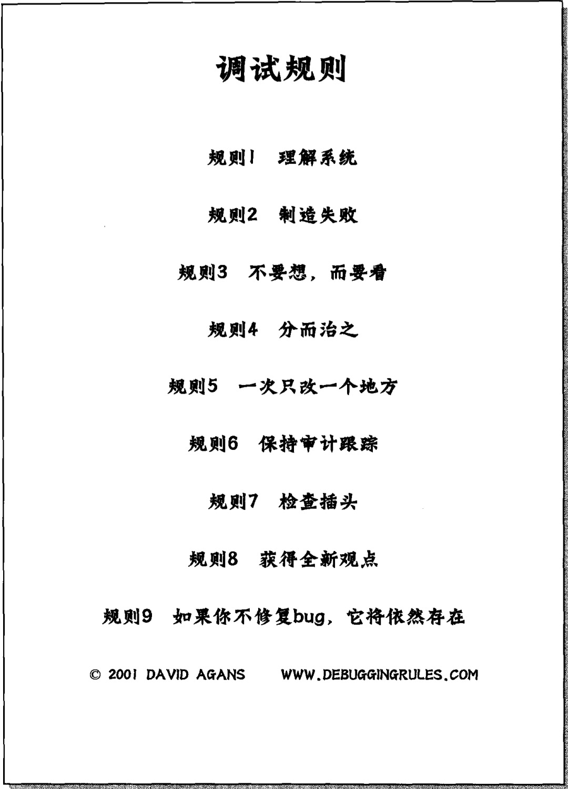

</p>

## 汇编语言

> 尽管作为一名 iOS 程序员，在工作的大部分时间都不会与汇编打交道，但是了解汇编依然大有裨益，尤其是在调试没有源码的系统库和第三方库时。

汇编语言是面向机器的程序设计语言，可以将其看成是各种 CPU 的机器指令的助记符集合。程序员可以使用汇编代码直接控制硬件系统工作，而且用汇编语言编写的程序具备执行速度快和占用内存少等优点。

在 Apple 平台上主流的汇编语言有 x86 汇编 和 ARM 汇编，在移动设备上使用的是 ARM 汇编，这主要是因为 ARM 采用的是 RISC 架构，具备功耗低的优势，而桌面平台使用的则是 x86 汇编。iOS 模拟器的程序实际就是以 iOS 模拟器作为容器，运行在该容器中的 Mac OS 程序，所以它使用的汇编也是 x86 汇编。由于我们的案例是在 iOS 模拟器中进行调试的，所以主要的研究目标是 x86 汇编。

### AT&T 和 Intel

x86 汇编语言演变出两个语法分支: Intel（最初用于 x86 平台的文档中）和 AT&T，其中 Intel 语法在 MS-DOS 和 Windows 家族中占主导地位，而 AT&T 语法则常见于 UNIX 家族中。Intel 和 AT&T 汇编在语法上存在巨大的差异，这主要体现在变量、常量、寄存器访问、间接寻址和偏移量等方面。虽然两者语法上存在巨大差异，但所基于的硬件体系是相同的，因此可以将两者其一移植到另一种的汇编格式。在 Xcode 中的汇编语法使用的是 AT&T，所以下文会重点关注 AT&T 汇编语法。

> 读者需要注意的是反汇编工具 Hopper Disassemble 和 IDA Pro 使用的是 Intel 汇编语法。

Intel 和 AT&T 汇编语法的差异主要有以下几个方面：

1. 操作数前缀：AT&T 汇编语法中的寄存器名称都以 `%` 作为前缀，立即操作数则以 `$` 作为前缀，而 Intel 汇编语法的寄存器和立即数均无前缀修饰。另外一个区别是 AT&T 汇编语法中的十六进制会加上 `0x` 前缀。下表给出了两者操作数前缀区别的示例：

	| AT&T | Intel |
	|:-------:|:-------:|
	| movq %rax, %rbx | mov rbx, rax |
	| addq $0x10, %rsp | add rsp, 010h |
	
	> Intel 汇编语法中的立即数与 AT&T 还有一点不同，其 16 进制和 2 进制分别以 `h` 和 `b` 作为后缀。

2. 操作数方向：在 AT&T 汇编语法中，第一个操作数为源操作数，第二个操作数为目的操作数，Intel 汇编语法的操作数顺序正好相反。从这个角度来看，AT&T 汇编语法似乎更接近人们日常的阅读习惯。
3. 寻址方式：与 Intel 汇编语法相比，AT&T 的间接寻址方式会显得更难读懂一些，但是二者地址计算的公式都是：`address = disp + base + index * scale`，其中 `base` 为基址，`disp` 为偏移地址，`index * scale` 决定了第几个元素，`scale` 为元素长度，只能为 2 的幂，`disp/base/index/scale` 全部都是可选的, `index` 默认为 0，`scale` 默认为 1。最终 AT&T 汇编指令的格式是 `%segreg: disp(base,index,scale)`，Intel 汇编指令的格式是 `segreg: [base+index*scale+disp]`。上面两种格式中给出的其实是段式寻址，其中 `segreg` 是段寄存器，使用在实模式下，当 CPU 可以寻址空间的位数超过寄存器的位数时，例如 CPU 可以寻址 20 位地址空间时，但寄存器只有 16 位，为了达到 20 位的寻址，就需要使用 `segreg:offset` 的方式来寻址，这样计算出来的偏移地址就是 `segreg * 16 + offset`，这种方式比平坦内存模式的寻址要复杂。在保护模式下，是在线性地址空间下进行寻址，也就不必考虑段基址。

	| AT&T | Intel |
	|:-------:|:-------:|
	| movq 0xb57751(%rip), %rsi | mov rsi, qword ptr [rip+0xb57751h] |
	| leaq (%rax,%rbx,8), %rdi | lea rdi, qword ptr [rax+rbx*8] |

	> 如果在 `disp` 和 `scale` 的位置上出现立即数，不用加上 `$` 后缀。在 Intel 语法中，需要在内存操作数前面加上 `byte ptr`、`word ptr` 、`dword ptr` 和 `qword ptr`。
	
4. 操作码的后缀：AT&T 汇编语法会在操作码后面带上一个后缀，其含义就是明确操作码的大小。后缀一般有四种: `b`、`w`、`l` 和 `q`，其中 `b` 是 8 位的字节（byte），`w` 是 16 位的字（word），`l` 是 32 位的双字（dword），在许多机器上 32 位数都被称为长字（long word），这其实是 16 位字作为标准的那个时代遗留下来的历史称呼，`q` 是 64 位的四字（qword）。 下面分别列出了数据传送指令（mov）的 AT&T 和 Intel 的语法版本。

	| AT&T | Intel |
	|:-------:|:-------:|
	| movb %al, %bl | mov bl, al |
	| movw %ax, %bx | mov bx, ax |
	| movl %eax, %ebx | mov ebx, eax |
	| movq %rax, %rbx | mov rbx, rax |
	
### 寄存器

众所周知，内存(Memory)为 CPU 存放指令和数据，内存本质上就是一个字节数组。虽然访问内存的速度相对来说已经很快了，但是仍然需要一个容量更小的，速度更快的存储单元来加快 CPU 执行指令的速度，这种存储单元就是寄存器。处理器在执行指令的过程中，所有数据在寄存器里面都只是临时存放的，然后又会被送往别处，这也是“寄存器”得名的原因。

当处理器从 16 位发展到 32 位的时候，扩展了 8 个通用寄存器的长度，使得寄存器变成 32 位，于是在汇编语言中使用这些扩展后的寄存器时，便在原先寄存器的名称里加上了 E(Extend) 前缀。32 位处理器结构，也就是 “Intel 32 位体系结构”(Intel Architecture 32-bit)，简称 IA32。现在主流的处理架构都是 64 位的 Intel64，是 IA32 的 64 位扩展，而我们可能更熟悉他的另外一个名称 “x86-64”。由于 IA32 已经成为历史，所以文章会集中介绍 x86-64。 x86-64 中将通用寄存器从 8 个扩展到了 16 个，正因为如此，所以可以借助寄存器来保存程序状态，而不是像原先那样通过栈来保存程序状态，这极大地减少了访问内存的次数。

x86-64 有 16 个 64 位通用寄存器和 16 个浮点数寄存器，此外 CPU 还有一个 64 位的指令指针寄存器 rip，它存放了将要执行的下一条指令的地址。还有其他一些我们可能用不到的寄存器，就不在文章中介绍了。16 个通用寄存器组除了从 IA32 的扩展而来的 64 位寄存器：rax、rcx、rdx、rbx、rsi、rdi、rsp 和 rbp，还有新增加的 8 个寄存器 r8 - r15。16 个浮点数寄存器组则为 xmm0 - xmm15。

如今的 CPU 是从 8088 CPU 发展而来的，寄存器也从 16 位扩展到 32 位，最终扩展到现在的 64 位，上文已经提及 x86-64 CPU 有 16 个 64 位的通用寄存器。而事实上程序依然可以访问每个寄存器的低 32 位、低 16 位和低 8 位。

下图描述的是 x86-64 的通用寄存器组

<p align="center">

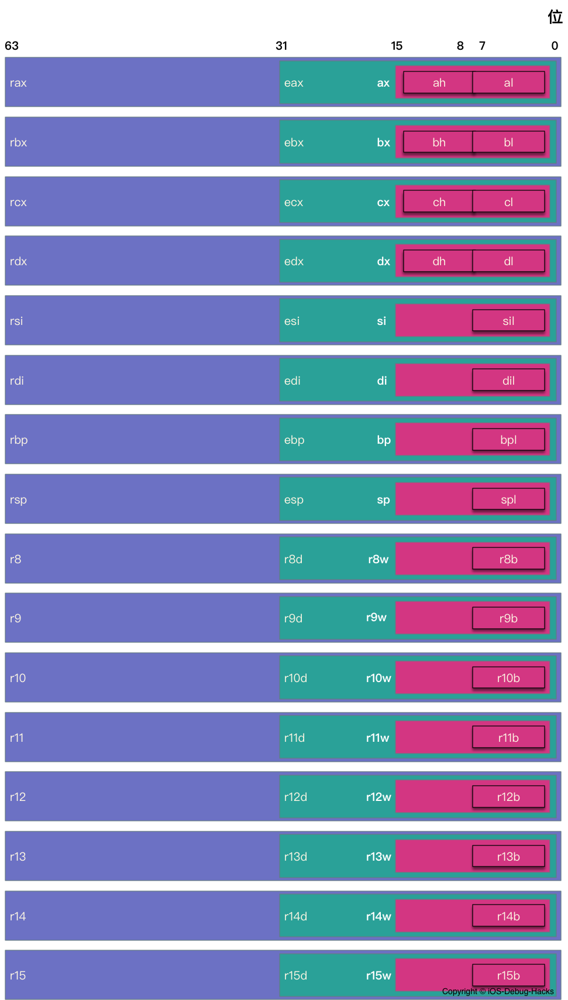

</p>

使用 LLDB 的 `register read` 命令可以 dump 出当前帧的寄存器的值。

例如我们可以使用如下命令显示所有寄存器的值：

```
register read -a 或 register read --all
```

```
General Purpose Registers:
       rax = 0x00007ff8b680c8c0
       rbx = 0x00007ff8b456fe30
       rcx = 0x00007ff8b6804330
       rdx = 0x00007ff8b6804330
       rdi = 0x00007ff8b456fe30
       rsi = 0x000000010cba6309  "initWithTask:delegate:delegateQueue:"
       rbp = 0x000070000f1bcc90
       rsp = 0x000070000f1bcc18
        r8 = 0x00007ff8b680c8c0
        r9 = 0x00000000ffff0000
       r10 = 0x00e6f00100e6f080
       r11 = 0x000000010ca13306  CFNetwork`-[__NSCFURLLocalSessionConnection initWithTask:delegate:delegateQueue:]
       r12 = 0x00007ff8b4687c70
       r13 = 0x000000010a051800  libobjc.A.dylib`objc_msgSend
       r14 = 0x00007ff8b4433bd0
       r15 = 0x00007ff8b6804330
       rip = 0x000000010ca13306  CFNetwork`-[__NSCFURLLocalSessionConnection initWithTask:delegate:delegateQueue:]
    rflags = 0x0000000000000246
        cs = 0x000000000000002b
        fs = 0x0000000000000000
        gs = 0x0000000000000000
       eax = 0xb680c8c0
       ebx = 0xb456fe30
       ecx = 0xb6804330
       edx = 0xb6804330
       edi = 0xb456fe30
       esi = 0x0cba6309
       ebp = 0x0f1bcc90
       esp = 0x0f1bcc18
       r8d = 0xb680c8c0
       r9d = 0xffff0000
      r10d = 0x00e6f080
      r11d = 0x0ca13306
      r12d = 0xb4687c70
      r13d = 0x0a051800
      r14d = 0xb4433bd0
      r15d = 0xb6804330
        ax = 0xc8c0
        bx = 0xfe30
        cx = 0x4330
        dx = 0x4330
        di = 0xfe30
        si = 0x6309
        bp = 0xcc90
        sp = 0xcc18
       r8w = 0xc8c0
       r9w = 0x0000
      r10w = 0xf080
      r11w = 0x3306
      r12w = 0x7c70
      r13w = 0x1800
      r14w = 0x3bd0
      r15w = 0x4330
        ah = 0xc8
        bh = 0xfe
        ch = 0x43
        dh = 0x43
        al = 0xc0
        bl = 0x30
        cl = 0x30
        dl = 0x30
       dil = 0x30
       sil = 0x09
       bpl = 0x90
       spl = 0x18
       r8l = 0xc0
       r9l = 0x00
      r10l = 0x80
      r11l = 0x06
      r12l = 0x70
      r13l = 0x00
      r14l = 0xd0
      r15l = 0x30

Floating Point Registers:
     fctrl = 0x037f
     fstat = 0x0000
      ftag = 0x00
       fop = 0x0000
     fioff = 0x00000000
     fiseg = 0x0000
     fooff = 0x00000000
     foseg = 0x0000
     mxcsr = 0x00001fa1
  mxcsrmask = 0x0000ffff
     stmm0 = {0x00 0x00 0x00 0x00 0x00 0x00 0x00 0x00 0xff 0xff}
     stmm1 = {0x00 0x01 0x00 0x00 0x00 0x00 0x00 0x00 0xff 0xff}
     stmm2 = {0x00 0x00 0x00 0x00 0x00 0x00 0x00 0x00 0x00 0x00}
     stmm3 = {0x00 0x00 0x00 0x00 0x00 0x00 0x00 0x00 0x00 0x00}
     stmm4 = {0x00 0x00 0x00 0x00 0x00 0x00 0xbc 0x87 0x0b 0xc0}
     stmm5 = {0x00 0x00 0x00 0x00 0x00 0x00 0x00 0x00 0x00 0x00}
     stmm6 = {0x00 0x00 0x00 0x00 0x00 0x00 0x78 0xbb 0x0b 0x40}
     stmm7 = {0x00 0x00 0x00 0x00 0x00 0x00 0x00 0x00 0x00 0x00}
      ymm0 = {0x00 0x00 0x00 0x00 0x00 0x00 0x00 0x00 0x00 0x00 0x00 0x00 0x00 0x00 0x00 0x00 0x00 0x00 0x00 0x00 0x00 0x00 0x00 0x00 0x00 0x00 0x00 0x00 0x00 0x00 0x00 0x00}
      ymm1 = {0x00 0x00 0x00 0x00 0x00 0x00 0x00 0x00 0x00 0x00 0x00 0x00 0x00 0x00 0x00 0x00 0x00 0x00 0x00 0x00 0x00 0x00 0x00 0x00 0x00 0x00 0x00 0x00 0x00 0x00 0x00 0x00}
      ymm2 = {0x00 0x00 0x00 0x00 0x00 0x00 0x00 0x00 0x00 0x00 0x00 0x00 0x00 0x00 0x00 0x00 0x00 0x00 0x00 0x00 0x00 0x00 0x00 0x00 0x00 0x00 0x00 0x00 0x00 0x00 0x00 0x00}
      ymm3 = {0x00 0x00 0x00 0x00 0x00 0x00 0x00 0x00 0x00 0x00 0x00 0x00 0x00 0x00 0x00 0x00 0x00 0x00 0x00 0x00 0x00 0x00 0x00 0x00 0x00 0x00 0x00 0x00 0x00 0x00 0x00 0x00}
      ymm4 = {0x00 0x00 0x00 0x00 0x00 0x00 0x00 0x00 0x00 0x00 0x00 0x00 0x00 0x00 0x00 0x00 0x00 0x00 0x00 0x00 0x00 0x00 0x00 0x00 0x00 0x00 0x00 0x00 0x00 0x00 0x00 0x00}
      ymm5 = {0x00 0x00 0x00 0x00 0x00 0x00 0x00 0x00 0x00 0x00 0x00 0x00 0x00 0x00 0x00 0x00 0x00 0x00 0x00 0x00 0x00 0x00 0x00 0x00 0x00 0x00 0x00 0x00 0x00 0x00 0x00 0x00}
      ymm6 = {0x00 0x00 0x00 0x00 0x00 0x00 0x00 0x00 0x00 0x00 0x00 0x00 0x00 0x00 0x00 0x00 0x00 0x00 0x00 0x00 0x00 0x00 0x00 0x00 0x00 0x00 0x00 0x00 0x00 0x00 0x00 0x00}
      ymm7 = {0x00 0x00 0x00 0x00 0x00 0x00 0x00 0x00 0x00 0x00 0x00 0x00 0x00 0x00 0x00 0x00 0x00 0x00 0x00 0x00 0x00 0x00 0x00 0x00 0x00 0x00 0x00 0x00 0x00 0x00 0x00 0x00}
      ymm8 = {0x00 0x00 0x00 0x00 0x00 0x00 0x00 0x00 0x00 0x00 0x00 0x00 0x00 0x00 0x00 0x00 0x00 0x00 0x00 0x00 0x00 0x00 0x00 0x00 0x00 0x00 0x00 0x00 0x00 0x00 0x00 0x00}
      ymm9 = {0x00 0x00 0x00 0x00 0x00 0x00 0x00 0x00 0x00 0x00 0x00 0x00 0x00 0x00 0x00 0x00 0x00 0x00 0x00 0x00 0x00 0x00 0x00 0x00 0x00 0x00 0x00 0x00 0x00 0x00 0x00 0x00}
     ymm10 = {0x00 0x00 0x00 0x00 0x00 0x00 0x00 0x00 0x00 0x00 0x00 0x00 0x00 0x00 0x00 0x00 0x00 0x00 0x00 0x00 0x00 0x00 0x00 0x00 0x00 0x00 0x00 0x00 0x00 0x00 0x00 0x00}
     ymm11 = {0x00 0x00 0x00 0x00 0x00 0x00 0x00 0x00 0x00 0x00 0x00 0x00 0x00 0x00 0x00 0x00 0x00 0x00 0x00 0x00 0x00 0x00 0x00 0x00 0x00 0x00 0x00 0x00 0x00 0x00 0x00 0x00}
     ymm12 = {0x00 0x00 0x00 0x00 0x00 0x00 0x00 0x00 0x00 0x00 0x00 0x00 0x00 0x00 0x00 0x00 0x00 0x00 0x00 0x00 0x00 0x00 0x00 0x00 0x00 0x00 0x00 0x00 0x00 0x00 0x00 0x00}
     ymm13 = {0x00 0x00 0x00 0x00 0x00 0x00 0x00 0x00 0x00 0x00 0x00 0x00 0x00 0x00 0x00 0x00 0x00 0x00 0x00 0x00 0x00 0x00 0x00 0x00 0x00 0x00 0x00 0x00 0x00 0x00 0x00 0x00}
     ymm14 = {0x00 0x00 0x00 0x00 0x00 0x00 0x00 0x00 0x00 0x00 0x00 0x00 0x00 0x00 0x00 0x00 0x00 0x00 0x00 0x00 0x00 0x00 0x00 0x00 0x00 0x00 0x00 0x00 0x00 0x00 0x00 0x00}
     ymm15 = {0x00 0x00 0x00 0x00 0x00 0x00 0x00 0x00 0x00 0x00 0x00 0x00 0x00 0x00 0x00 0x00 0x00 0x00 0x00 0x00 0x00 0x00 0x00 0x00 0x00 0x00 0x00 0x00 0x00 0x00 0x00 0x00}
      xmm0 = {0x00 0x00 0x00 0x00 0x00 0x00 0x00 0x00 0x00 0x00 0x00 0x00 0x00 0x00 0x00 0x00}
      xmm1 = {0x00 0x00 0x00 0x00 0x00 0x00 0x00 0x00 0x00 0x00 0x00 0x00 0x00 0x00 0x00 0x00}
      xmm2 = {0x00 0x00 0x00 0x00 0x00 0x00 0x00 0x00 0x00 0x00 0x00 0x00 0x00 0x00 0x00 0x00}
      xmm3 = {0x00 0x00 0x00 0x00 0x00 0x00 0x00 0x00 0x00 0x00 0x00 0x00 0x00 0x00 0x00 0x00}
      xmm4 = {0x00 0x00 0x00 0x00 0x00 0x00 0x00 0x00 0x00 0x00 0x00 0x00 0x00 0x00 0x00 0x00}
      xmm5 = {0x00 0x00 0x00 0x00 0x00 0x00 0x00 0x00 0x00 0x00 0x00 0x00 0x00 0x00 0x00 0x00}
      xmm6 = {0x00 0x00 0x00 0x00 0x00 0x00 0x00 0x00 0x00 0x00 0x00 0x00 0x00 0x00 0x00 0x00}
      xmm7 = {0x00 0x00 0x00 0x00 0x00 0x00 0x00 0x00 0x00 0x00 0x00 0x00 0x00 0x00 0x00 0x00}
      xmm8 = {0x00 0x00 0x00 0x00 0x00 0x00 0x00 0x00 0x00 0x00 0x00 0x00 0x00 0x00 0x00 0x00}
      xmm9 = {0x00 0x00 0x00 0x00 0x00 0x00 0x00 0x00 0x00 0x00 0x00 0x00 0x00 0x00 0x00 0x00}
     xmm10 = {0x00 0x00 0x00 0x00 0x00 0x00 0x00 0x00 0x00 0x00 0x00 0x00 0x00 0x00 0x00 0x00}
     xmm11 = {0x00 0x00 0x00 0x00 0x00 0x00 0x00 0x00 0x00 0x00 0x00 0x00 0x00 0x00 0x00 0x00}
     xmm12 = {0x00 0x00 0x00 0x00 0x00 0x00 0x00 0x00 0x00 0x00 0x00 0x00 0x00 0x00 0x00 0x00}
     xmm13 = {0x00 0x00 0x00 0x00 0x00 0x00 0x00 0x00 0x00 0x00 0x00 0x00 0x00 0x00 0x00 0x00}
     xmm14 = {0x00 0x00 0x00 0x00 0x00 0x00 0x00 0x00 0x00 0x00 0x00 0x00 0x00 0x00 0x00 0x00}
     xmm15 = {0x00 0x00 0x00 0x00 0x00 0x00 0x00 0x00 0x00 0x00 0x00 0x00 0x00 0x00 0x00 0x00}

Exception State Registers:
    trapno = 0x00000003
       err = 0x00000000
  faultvaddr = 0x000000010bb91000  
```

上文已经提到在 x86-64 中有 16 个浮点数寄存器：xmm0 - xmm15，但这种说法其实隐藏了很多细节，其实在执行 `register read -a` 命令的输出结果中，读者或许已经观察到除了前面提到的 xmm 寄存器组，还有 stmm 和 ymm 寄存器组。stmm 应该是 st 寄存器的别名，而 st 是 x86 的浮点运算单元 FPU(Float Point Unit)用来处理浮点数据的寄存器，x86 的 FPU 中包含一个浮点寄存器栈，它包含了 8 个 80 位的可以直接进行浮点运算的寄存器 st0 - st7，我们可以观察到输出中的 stmm 寄存器也是 80 位的，这也证明了 stmm 其实就是 st 寄存器。xmm 寄存器是 128 位的，而 ymm 寄存器组则是 xmm 的 256 位扩展版本。其实 xmm 寄存器只不过是 ymm 寄存器的低 128 位。它们之间的关系就类似前面提到的通用寄存器中 eax 寄存器是 rax 寄存器的低 32 位。SSE（Streaming SIMD Extensions）是 Intel 在 Pentium III 中推出的 [MMX](https://zh.wikipedia.org/wiki/MMX) 扩充的指令集，SSE 增加了新的 8 个 128 位寄存器（xmm0 - xmm7）。AVX(Advanced Vector Extensions) 指令集是 SSE 的扩展架构，前面提到的 128 位 xmm 寄存器提升至 256 位 ymm 寄存器，就是在 AVX 架构中引入的。

<p align="center">

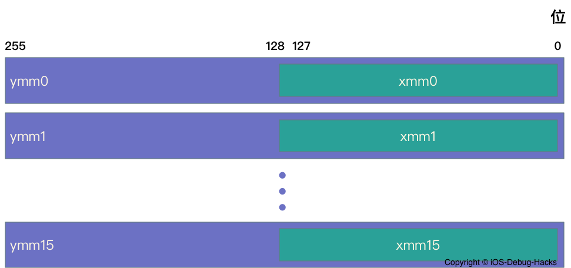

</p>
	
### 函数

一个函数调用包括将数据（以参数和返回值的形式）和控制从代码的一部分转移到另一部分。在函数调用过程中，数据传递、局部变量的分配和释放是通过栈来实现的，而为单个函数调用分配的那部分栈称为栈帧（Stack Frame）。

> OS X x86-64 函数调用约定与 [System V Application Binary Interface AMD64 Architecture Processor Supplement](http://www.ucw.cz/~hubicka/papers/abi/) 文档中描述的函数调用约定是一致的，因此鼓励读者去翻阅这篇文档。

#### 栈帧

使用 LLDB 调试的过程中我们可能会使用 `bt` 命令打印出当前线程的回溯信息，如下：

```
(lldb) bt
* thread #1, queue = 'com.apple.main-thread', stop reason = breakpoint 1.1
  * frame #0: 0x00000001054e09d4 TestDemo`-[ViewController viewDidLoad](self=0x00007fd349558950, _cmd="viewDidLoad") at ViewController.m:18
    frame #1: 0x00000001064a6931 UIKit`-[UIViewController loadViewIfRequired] + 1344
    frame #2: 0x00000001064a6c7d UIKit`-[UIViewController view] + 27
    frame #3: 0x00000001063840c0 UIKit`-[UIWindow addRootViewControllerViewIfPossible] + 61
    // 更多的 frame 已被省略
```

事实上 `bt` 命令是得益于栈帧才能实现的，栈帧可以看成是函数执行的上下文，其中保存了函数的返回地址和局部变量，我们知道堆是从低地址向高地址延伸的，而栈是从高地址向低地址延伸的。每个函数的每次调用，都会分配给它一个独立的栈帧，rbp 寄存器指向当前栈帧的底部（高地址），被称作帧指针，rsp 寄存器指向栈帧的顶部（低地址），被称作栈指针。下图是栈帧的结构图：

<p align="center">

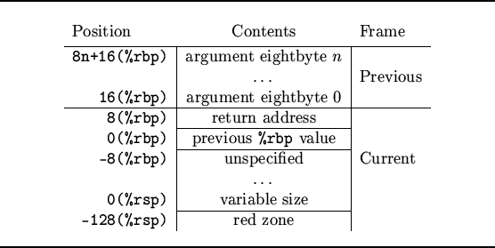

</p>

图中左侧 `Position` 为内存地址，使用的是间接寻址的方式，Content 为前面内存地址存放的值，结合上图的栈帧结构我们分析一次函数调用的过程如下：

1. 调用函数将参数压栈，如果没有参数，或者可以直接通过寄存器完成传参，则这步可以没有。
2. 将执行完函数调用的下一条指令压栈，其实就是返回地址。
3. 跳转到被调函数的起始地址开始执行。
4. 被调函数将调用函数栈帧起始地址压栈，栈帧起始地址存放在 %rbp 寄存器中。
5. 将 %rsp 寄存器赋值给 %rbp 寄存器，使得 %rbp 寄存器指向被调函数栈帧的起始地址。
6. 将被调用者保存寄存器压栈，这步是可选的。

上述 2 和 3 步骤其实就是 `call` 指令的任务，而 4 和 5 通过汇编指令表示如下：

```
TestDemo`-[ViewController viewDidLoad]:
    0x1054e09c0 <+0>:  pushq  %rbp //第四步
    0x1054e09c1 <+1>:  movq   %rsp, %rbp //第五步
```

我们很容易观察到每个函数的前两条汇编指令都是上面的这两条。图中还有一个细节就是在 rsp 寄存器下面还有一个 128 字节的红色区域，ABI 将这个区域称为红色地带，它是保留区域，不会被中断或信号改写，但是在函数调用过程中会被破坏，所以可以用于叶子函数的临时数据，叶子函数指的是那些不调用其他函数的函数。

```
UIKit`-[UIViewController loadViewIfRequired]:
    0x1064a63f1 <+0>:    pushq  %rbp
    0x1064a63f2 <+1>:    movq   %rsp, %rbp
    0x1064a63f5 <+4>:    pushq  %r15
    0x1064a63f7 <+6>:    pushq  %r14
    0x1064a63f9 <+8>:    pushq  %r13
    0x1064a63fb <+10>:   pushq  %r12
    0x1064a63fd <+12>:   pushq  %rbx
```

上述汇编命令从 `0x1064a63f5` 到 `0x1064a63fd` 都属于第 6 步，在调用约定中有一类寄存器称作被调用者保存寄存器，它指的是当调用函数使用了这类寄存器，那么被调函数必须在使用之前，将它们压栈保存，然后当返回到调用函数栈帧之前，将它们出栈恢复。下面是出栈的汇编指令，可以看出 rbx 和 r12-r15 都属于这类寄存器。

```
    0x1064a6c4b <+2138>: addq   $0x1f8, %rsp              ; imm = 0x1F8 
    0x1064a6c52 <+2145>: popq   %rbx
    0x1064a6c53 <+2146>: popq   %r12
    0x1064a6c55 <+2148>: popq   %r13
    0x1064a6c57 <+2150>: popq   %r14
    0x1064a6c59 <+2152>: popq   %r15
    0x1064a6c5b <+2154>: popq   %rbp
    0x1064a6c5c <+2155>: retq   
    0x1064a6c5d <+2156>: callq  0x106d69e9c               ; symbol stub for: __stack_chk_fail
```

#### Call 指令

调用函数的汇编指令是 `call`，示例如下：

```
call function
```

参数中的 `function` 是 **TEXT** 段的程序，`call` 指令其实可以拆解成两步，第一步是将执行完 `call` 指令之后的地址压栈，这个地址其实是执行完调用函数体之后的返回地址；第二步是将指令执行跳转到 `function`。 `call` 指令其实等价于下面的命令：

```
push next_instruction
jmp  function
```

下面是在 iOS 模拟器中的 `call` 指令的示例：

```
    0x10915c714 <+68>:  callq  0x1093ca502               ; symbol stub for: objc_msgSend
    0x105206433 <+66>:  callq  *0xb3cd47(%rip)           ; (void *)0x000000010475e800: objc_msgSend
```
代码中给出了两种 `call` 指令的用法，第一种操作数是一个内存地址，该内存地址其实是 Mach-O 文件的符号桩（Symbol Stub），它会通过动态链接库链接器查找函数的 symbol，然后执行函数。第二种的操作数是通过间接寻址得到的。另外 AT&T 语法的绝对跳转/调用（和程序计数器相关的跳转）指令的立即数操作数前面要加 `*`。

#### Ret 指令

通常会使用 `ret` 指令从被调函数返回到调用函数，这个指令实际就是从栈顶弹出地址，并跳转到这个位置继续执行。在上面的例子中其实就是跳转回 `next_instruction`。在执行 `ret` 命令之前，会将被调用者保存寄存器出栈，这个在上面分析栈帧结构中函数调用的第 6 步的汇编例子中已经说明。

#### 传参和返回值

大多数函数都有参数，参数可能是整数、浮点数和指针等。此外通常函数还会有返回值，比如表明执行函数的执行结果是成功还是失败。在 OSX 中，最多可以有 6 个整型（整数和指针）通过寄存器传递，这 6 个寄存器分别是 rdi, rsi, rdx, rcx, r8 和 r9(顺序和参数的顺序保持一致)，如果一个函数超过 6 个参数该怎么办呢？不可否认确实会存在这种情况，此时就需要借助栈了，可以将剩下的参数逆序压入栈中。OSX 允许将 8 个浮点数通过浮点数寄存器 xmm0-xmm7 进行传递。

关于函数的返回值，使用 rax 寄存器作为整数返回值，浮点数返回值则使用 xmm0-xmm1 寄存器。下图非常清晰的给出了函数调用过程中寄存器的使用约定。

<p align="center">

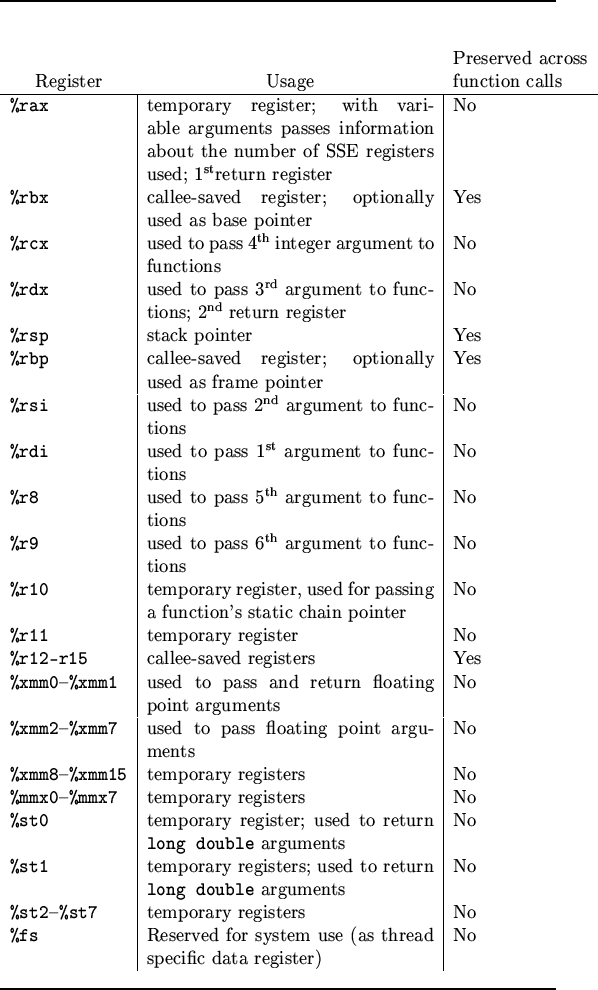

</p>

上图中的 `preserved across function calls` 表明该寄存器是否上文提及的保存寄存器，可以观察到除了上文已经提过的 rbx 和 r12-r15，rsp 和 rbp 也是栈保存寄存器，这主要是因为这两个寄存器保存着指向程序栈重要位置的指针，这个在讲解函数调用过程中的栈帧结构的时候已经详细说明，此处不再赘述。

下面将以一个真实的例子来讲解函数调用过程中的汇编指令，我们以 CocoaLumberjack 中的 `DDLogError` 这个宏进行讲解，调用这个宏实际会调用 `log:level:flag:context:file:function:line:tag:format:` 类方法，下面的代码清单是调用 `DDLogError` 的源代码和对应的汇编代码：

```
- (IBAction)test:(id)sender {
    DDLogError(@"TestDDLog:%@", sender);
}
```

```
    0x102c568a3 <+99>:  xorl   %edx, %edx
    0x102c568a5 <+101>: movl   $0x1, %eax
    0x102c568aa <+106>: movl   %eax, %r8d
    0x102c568ad <+109>: xorl   %eax, %eax
    0x102c568af <+111>: movl   %eax, %r9d
    0x102c568b2 <+114>: leaq   0x2a016(%rip), %rcx       ; "/Users/dev-aozhimin/Desktop/TestDDLog/TestDDLog/ViewController.m"
    0x102c568b9 <+121>: leaq   0x2a050(%rip), %rsi       ; "-[ViewController test:]"
    0x102c568c0 <+128>: movl   $0x22, %eax
    0x102c568c5 <+133>: movl   %eax, %edi
    0x102c568c7 <+135>: leaq   0x2dce2(%rip), %r10       ; @"\eTestDDLog:%@"
    0x102c568ce <+142>: movq   0x33adb(%rip), %r11       ; (void *)0x0000000102c8ad18: DDLog
    0x102c568d5 <+149>: movq   0x34694(%rip), %rbx       ; ddLogLevel
    0x102c568dc <+156>: movq   -0x30(%rbp), %r14
    0x102c568e0 <+160>: movq   0x332f9(%rip), %r15       ; "log:level:flag:context:file:function:line:tag:format:"
    0x102c568e7 <+167>: movq   %rdi, -0x48(%rbp)
    0x102c568eb <+171>: movq   %r11, %rdi
    0x102c568ee <+174>: movq   %rsi, -0x50(%rbp)
    0x102c568f2 <+178>: movq   %r15, %rsi
    0x102c568f5 <+181>: movq   %rcx, -0x58(%rbp)
    0x102c568f9 <+185>: movq   %rbx, %rcx
    0x102c568fc <+188>: movq   -0x58(%rbp), %r11
    0x102c56900 <+192>: movq   %r11, (%rsp)
    0x102c56904 <+196>: movq   -0x50(%rbp), %rbx
    0x102c56908 <+200>: movq   %rbx, 0x8(%rsp)
    0x102c5690d <+205>: movq   $0x22, 0x10(%rsp)
    0x102c56916 <+214>: movq   $0x0, 0x18(%rsp)
    0x102c5691f <+223>: movq   %r10, 0x20(%rsp)
    0x102c56924 <+228>: movq   %r14, 0x28(%rsp)
    0x102c56929 <+233>: movb   $0x0, %al
    0x102c5692b <+235>: callq  0x102c7d2be               ; symbol stub for: objc_msgSend
```

由于 Objective-C 的方法最终会转化为对 `objc_msgSend` 方法的调用，所以 `log:level:flag:context:file:function:line:tag:format:` 方法最终会转化为如下代码：

```
objc_msgSend(DDLog, @selector(log:level:flag:context:file:function:line:tag:format:), asynchronous, level, flag, context, file, function, line, tag, format, sender)
```

上文已经提到函数调用的前 6 个参数可以使用寄存器，而超过的部分则只能通过栈帧来传递。上面的函数调用超过了 6 个参数，所以传参过程既会使用寄存器，也会压栈。下面两个表格描述了在调用 `DDLogError` 宏的传参过程使用到的寄存器和栈帧的详细情况。

| 通用寄存器 | 值 | 函数参数 | 汇编指令 | 备注 |
|:-------:|:-------:|:-------:|:-------:|:-------:|
| rdi | DDLog | self | 0x102c568eb <+171>: movq   %r11, %rdi | |
| rsi | "log:level:flag:context:file:function:line:tag:format:" | op | 0x102c568f2 <+178>: movq   %r15, %rsi | |
| rdx | 0 | asynchronous | 0x102c568a3 <+99>:  xorl   %edx, %edx | xorl 命令为异或运算，因此此处相当于将 edx 寄存器清零 |
| rcx | 18446744073709551615 | level | 0x102c568f9 <+185>: movq   %rbx, %rcx | (DDLogLevelAll 或 NSUIntegerMax) |
| r8 | 1 | flag | 0x102c568aa <+106>: movl   %eax, %r8d | DDLogFlagError |
| r9 | 0 | context | 0x102c568af <+111>: movl   %eax, %r9d | |

| 栈帧偏移 | 值 | 函数参数 | 汇编指令 | 备注 |
|:-------:|:-------:|:-------:|:-------:|:-------:|
| (%rsp) | "/Users/dev-aozhimin/Desktop/TestDDLog/TestDDLog/ViewController.m" | file | 0x102c56900 <+192>: movq   %r11, (%rsp) | |
| 0x8(%rsp) | "-[ViewController test:]" | function | 0x102c56908 <+200>: movq   %rbx, 0x8(%rsp) | |
| 0x10(%rsp) | 0X22 | line | 0x102c5690d <+205>: movq   $0x22, 0x10(%rsp) | 对应的 DDLogError 调用在文件中的第 34 行 |
| 0x18(%rsp) | 0X0 | tag | 0x102c56916 <+214>: movq   $0x0, 0x18(%rsp) | nil |
| 0x20(%rsp) | "TestDDLog:%@" | format | 0x102c5691f <+223>: movq   %r10, 0x20(%rsp) | |
| 0x28(%rsp) | sender | 可变参数中的第一个参数 | 0x102c56924 <+228>: movq   %r14, 0x28(%rsp) | UIButton 的实例 |

> 当寄存器的值是字符串的时候，比如上面 `rsi` 寄存器存储 `op` 参数的值，LLDB 可以通过 `po (char *) $rsi` 命令输出寄存器对应的字符串值，否则直接使用 `po $rsi`，只会按照整数格式输出 `rsi` 寄存器的值。

借助汇编知识，我们得以窥视底层的一些东西，这在有些调试场景下确有必要。尽管我很努力的想将汇编知识全部介绍完，然而汇编的知识体系过于庞杂，无法在如此有限的篇幅内全部覆盖完。我希望读者能翻阅文章提到的参考资料，并且我极力推荐读者去阅读 **CSAPP** 的第三章——程序的机器级表示，它是难得的汇编相关的辅助材料。

## 案例

文章通过一个真实的“案例故事”来描述调试过程，有些细节被我改动了，以便保护个人隐私。

### 问题

故事发生我在做登录 SDK 开发的过程中，产线接到用户反馈，在点击登录页面的 QQ 图标的时候出现应用闪退的情况，试图重现的过程中发现是在用户手机未安装 QQ 的情况下，使用 QQ 登录的时候会去拉起 QQ Web 授权页，但此时会出现 `[TCWebViewController setRequestURLStr:]` 找不到 selector 的情况。

> 注意：为了更好的讲解，下面所有涉及到具体业务，与本主题无关的地方没有列出来，同时应用名称用 **AADebug** 代替。

应用崩溃的堆栈信息如下：

```
Terminating app due to uncaught exception 'NSInvalidArgumentException', reason: '-[TCWebViewController setRequestURLStr:]: unrecognized selector sent to instance 0x7fe25bd84f90'
*** First throw call stack:
(
	0   CoreFoundation                      0x0000000112ce4f65 __exceptionPreprocess + 165
	1   libobjc.A.dylib                     0x00000001125f7deb objc_exception_throw + 48
	2   CoreFoundation                      0x0000000112ced58d -[NSObject(NSObject) doesNotRecognizeSelector:] + 205
	3   AADebug                             0x0000000108cffefc __ASPECTS_ARE_BEING_CALLED__ + 6172
	4   CoreFoundation                      0x0000000112c3ad97 ___forwarding___ + 487
	5   CoreFoundation                      0x0000000112c3ab28 _CF_forwarding_prep_0 + 120
	6   AADebug                             0x000000010a663100 -[TCWebViewKit open] + 387
	7   AADebug                             0x000000010a6608d0 -[TCLoginViewKit loadReqURL:webTitle:delegate:] + 175
	8   AADebug                             0x000000010a660810 -[TCLoginViewKit openWithExtraParams:] + 729
	9   AADebug                             0x000000010a66c45e -[TencentOAuth authorizeWithTencentAppAuthInSafari:permissions:andExtraParams:delegate:] + 701
	10  AADebug                             0x000000010a66d433 -[TencentOAuth authorizeWithPermissions:andExtraParams:delegate:inSafari:] + 564
………………………………………………………………………………………………………………………………………………………………………………………………………………………………………………………………………………………………………………………………………………………………………………………………

省略若干无关行	

………………………………………………………………………………………………………………………………………………………………………………………………………………………………………………………………………………………………………………………………………………………………………………………………
236
	14  libdispatch.dylib                   0x0000000113e28ef9 _dispatch_call_block_and_release + 12
	15  libdispatch.dylib                   0x0000000113e4949b _dispatch_client_callout + 8
	16  libdispatch.dylib                   0x0000000113e3134b _dispatch_main_queue_callback_4CF + 1738
	17  CoreFoundation                      0x0000000112c453e9 __CFRUNLOOP_IS_SERVICING_THE_MAIN_DISPATCH_QUEUE__ + 9
	18  CoreFoundation                      0x0000000112c06939 __CFRunLoopRun + 2073
	19  CoreFoundation                      0x0000000112c05e98 CFRunLoopRunSpecific + 488
	20  GraphicsServices                    0x0000000114a13ad2 GSEventRunModal + 161
	21  UIKit                               0x0000000110d3f676 UIApplicationMain + 171
	22  AADebug                             0x0000000108596d3f main + 111
	23  libdyld.dylib                       0x0000000113e7d92d start + 1
)
libc++abi.dylib: terminating with uncaught exception of type NSException
```


### 消息转发

在开始调试之前，准备用一些篇幅讲解 Objective-C 中的消息转发（message forwarding）机制。熟悉 Objective-C 的读者应该清楚，该语言使用的是“消息结构”，而非像 C 语言的“函数调用”，如果在编译期间向对象发送了其无法解读的消息并没什么大碍，因为当运行时期间对象接收到无法解读的对象后，它可以通过开启消息转发机制来做一些补救措施，具体来说就是由程序员来告诉对象应该如何处理这条未知消息。

消息转发中通常会涉及到下面四个方法：

1. `+ (BOOL)resolveInstanceMethod:(SEL)sel`：对象收到未知消息后，首先会调用该方法，参数就是未知消息的 selector，返回值则表示能否新增一个实例方法处理 selector 参数。如果这一步成功处理了 selector 后，返回 `YES`，后续的转发机制不再进行。事实上，这个被经常使用在要访问 **CoreData** 框架中的 NSManagedObjects 对象的 @dynamic 属性中，以动态的插入存取方法。<br/>`+ (BOOL)resolveClassMethod:(SEL)sel`：和上面方法类似，区别就是上面是实例方法，这个是类方法。
2. `- (id)forwardingTargetForSelector:(SEL)aSelector`：这个方法提供处理未知消息的备援接收者，这个比 `forwardInvocation:` 标准转发机制更快。通常可以用这个方案来模拟多继承的某些特性。这一步我们无法操作转发的消息，如果想修改消息的内容，则应该开启完整的消息转发流程来实现。
3. `- (NSMethodSignature *)methodSignatureForSelector:(SEL)aSelector`：如果消息转发的算法执行到这一步，代表已经开启了完整的消息转发机制，这个方法返回 `NSMethodSignature` 对象，其中包含了指定 selector 参数中的有关方法的描述，在消息转发流程中，如果需要创建 `NSInvocation` 对象也需要重写这个方法，`NSInvocation` 对象包含了 SEL、Target 和参数。
4. `- (void)forwardInvocation:(NSInvocation *)anInvocation`：方法的实现通常需要完成以下任务：找出能够处理 `anInvocation` 对象封装的消息的对象；使用 `anInvocation` 给前面找出的对象发送消息，`anInvocation` 会保存返回值，运行时会将返回值发送给原来的 sender。其实通过简单的改变调用目标，然后在改变后的目标上调用，该方法就能实现与 `forwardingTargetForSelector:` 一样的行为，然而基本不这样做。

通常将 1 和 2 的消息转发称为 **Fast Forwarding**，它提供了一种更为简便的方式进行消息转发，而为了与 **Fast Forwarding** 区分，3和4的消息转发被称之为 Normal Forwarding 或者 Regular Forwarding。 Normal Forwarding 因为要创建 **NSInvocation** 对象，所以更慢一些。

> 注意：如果 `methodSignatureForSelector` 方法返回的 `NSMethodSignature` 是 nil 或者根本没有重写 `methodSignatureForSelector`，则 `forwardInvocation` 不会被执行，消息转发流程终止，抛出无法处理的异常，这个在下文 `___forwarding___`函数的源码中可以看出。

下面这张流程图清晰地阐述了消息转发的流程。

<p align="center">

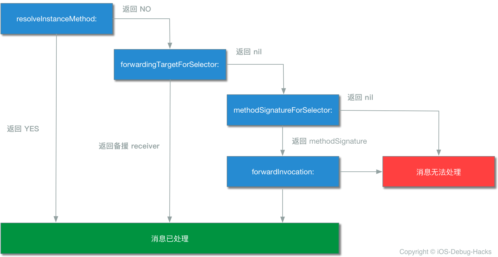

</p>

正如消息转发的流程图描述的，对象在上述流程的每一步都有机会处理消息。然而上文已经提到，消息转发流程越往后，处理消息所付出的代价也就越大。所以若非必要，应当尽早结束消息转发流程。如果消息转发的流程中都没有处理未知消息，最终会调用 `doesNotRecognizeSelector:` 抛出异常，表示对象无法正确识别此 SEL。

### 调试过程

根据上面出错信息中的 `TCWebViewController` 很自然联想到与腾讯的 SDK **TencentOpenAPI.framework** 有关，但是产线的应用出现问题的时间段内并没有更新腾讯的 SDK，所以应该不是直接由 **TencentOpenAPI.framework** 导致应用崩溃的。

首先通过反编译工具拿到 `TCWebViewController` 类的结构

```
@class TCWebViewController : UIViewController<UIWebViewDelegate, NSURLConnectionDelegate, NSURLConnectionDataDelegate> {
    @property webview
    @property webTitle
    @property requestURLStr
    @property error
    @property delegate
    @property activityIndicatorView
    @property finished
    @property theData
    @property retryCount
    @property hash
    @property superclass
    @property description
    @property debugDescription
    ivar _nloadCount
    ivar _webview
    ivar _webTitle
    ivar _requestURLStr
    ivar _error
    ivar _delegate
    ivar _xo
    ivar _activityIndicatorView
    ivar _finished
    ivar _theData
    ivar _retryCount
    -setError:
    -initWithNibName:bundle:
    -dealloc
    -stopLoad
    -doClose
    -viewDidLoad
    -loadReqURL
    -viewDidDisappear:
    -shouldAutorotateToInterfaceOrientation:
    -supportedInterfaceOrientations
    -shouldAutorotate
    -webViewDidStartLoad:
    -webViewDidFinishLoad:
    -webView:didFailLoadWithError:
    -webView:shouldStartLoadWithRequest:navigationType:
}
```

静态分析的结果发现 `TCWebViewController` 类中确实没有 `requestURLStr` 的 Setter 和 Getter 方法。因为之前版本没有出现崩溃，

此时产生一个想法：`TCWebViewController` 类中的 Property 会不会像 **Core Data** 框架一样，使用 `@dynamic` 告诉编译器不做处理，然后 Getter 和 Setter 方法是在运行时动态创建。于是带着这个猜想继续追踪下去，发现在 **TencentOpenAPI.framework** 中有个 `NSObject` 的 Category：`NSObject(MethodSwizzlingCategory)` 非常可疑，其中 `switchMethodForCodeZipper:` 方法分别将消息转发过程中的 `methodSignatureForSelector` 和 `forwardInvocation`方法替换为 `QQmethodSignatureForSelector` 和 `QQforwardInvocation`。

```objective-c
void +[NSObject switchMethodForCodeZipper](void * self, void * _cmd) {
    rbx = self;
    objc_sync_enter(self);
    if (*(int8_t *)_g_instance == 0x0) {
            [NSObject swizzleMethod:@selector(methodSignatureForSelector:) withMethod:@selector(QQmethodSignatureForSelector:)];
            [NSObject swizzleMethod:@selector(forwardInvocation:) withMethod:@selector(QQforwardInvocation:)];
            *(int8_t *)_g_instance = 0x1;
    }
    rdi = rbx;
    objc_sync_exit(rdi);
    return;
}
```

于是将视线转移到 `QQmethodSignatureForSelector` 中，发现在其中有个方法：`_AddDynamicPropertysSetterAndGetter`，从方法名称很容易知道这个方法就是动态地给属性添加 Setter 和 Getter 方法。基本验证了 `TCWebViewController` 类中的 Property 的 Setter 和 Getter 方法是在 Runtime 动态添加这个猜想。

```objective-c
void * -[NSObject QQmethodSignatureForSelector:](void * self, void * _cmd, void * arg2) {
    r14 = arg2;
    rbx = self;
    rax = [self QQmethodSignatureForSelector:rdx];
    if (rax == 0x0) {
            rax = sel_getName(r14);
            _AddDynamicPropertysSetterAndGetter();
            rax = 0x0;
            if (0x0 != 0x0) {
                    rax = [rbx methodSignatureForSelector:r14];
            }
    }
    return rax;
}
```

那究竟为什么 `TCWebViewController` 找不到 Setter 的 Selector 呢？是否在开发新版本的过程覆盖了 `QQMethodSignatureForSelector` 导致的呢？然而在搜遍项目的所有角落，并没有发现项目中替换有 `NSObject` 的 `methodSignatureForSelector`，问题有点棘手，分析到这一步，静态分析暂时告一段落，下一步将使用 LLDB 来动态调试腾讯的三方库，从而找出是哪一个环节破坏了消息转发过程中动态生成 Getter 和 Setter。

> 这里其实如果通过 LLDB 命令给 `setRequestURLStr` 方法打断点，会发现不能成功打上这个断点，原因也是因为 Setter 方法其实在编译时还没有，也能作为上面猜想的佐证。

根据崩溃堆栈中可以推测出 `setRequestURLStr` 是在 `-[TCWebViewKit open]` 方法中调用的，也就是发生在腾讯的 SDK 检查设备没有安装 QQ 从而去打开 Web 授权页这一过程中。

我们使用 LLDB 在这个方法下断点，命令如下：

```
br s -n "-[TCWebViewKit open]"
```

> `br s -n` 的前半部分 `br s` 是 `breakpoint set` 的意思，`-n` 表示根据函数名称来下断点，作用和符号断点一样，使用 `br s -F` 也是可以的。直接使用 `b -[TCWebViewKit open]` 能达到同样的效果，只不过 `b` 命令是 `_regexp-break` 的缩写，是用正则匹配的方式下断点。最后也可以给在指定的内存地址设置断点，下断点的命令为 `br s -a 0x000000010940b24e`，这种方式可以用在知道 block 内存地址的时候，给 block 设置断点。

断点成功打上。

```
Breakpoint 34: where = AADebug`-[TCWebViewKit open], address = 0x0000000103157f7d
```

当应用准备跳到 Web 授权页的时候，断点会被断住，会看到下图

<p align="center">

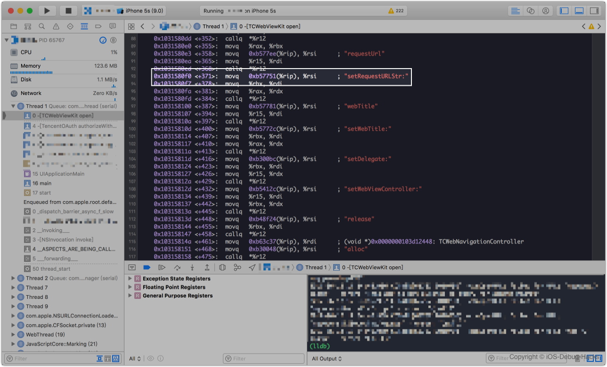

</p>

> 案例给出的是在模拟器中运行的截图，所以汇编代码是 X64 的，真机上看到的汇编代码是 ARM 汇编，但是分析的方法都是一样的，这点读者需要注意。

在下图 96 行的汇编代码打一个断点，这条汇编代码就是调用 `setRequestURLStr` 方法，然后打印出 `rbx` 寄存器的内容，可以观察到 `rbx` 寄存器保存的就是 `TCWebViewController` 实例。

<p align="center">

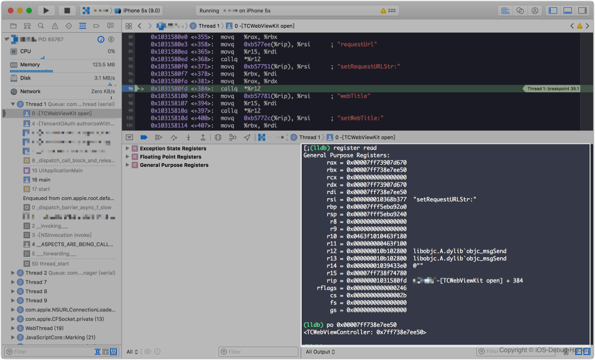

</p>

#### methodSignatureForSelector

接下来用 LLDB 给 `QQmethodSignatureForSelector` 方法下断点

```
br s -n "-[NSObject QQmethodSignatureForSelector:]"
```

LLDB 中输入 `c` 命令让端点继续执行，这个时候断点断在了 `QQmethodSignatureForSelector` 方法内部，所以推翻了 `QQmethodSignatureForSelector` 方法被我们项目替换的猜想。
<p align="center">

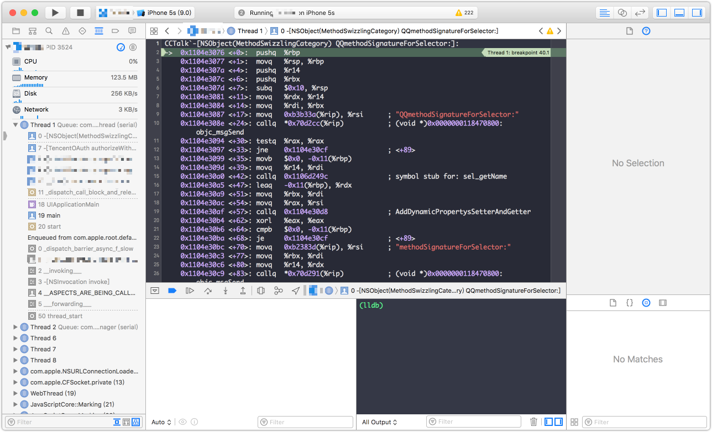

</p>

在 `QQmethodSignatureForSelector` 方法汇编代码的最后，也就是31行的 `retq` 指令处下一个断点，然后将寄存器 `rax` 存放的内存地址打印出来，如下图

<p align="center">

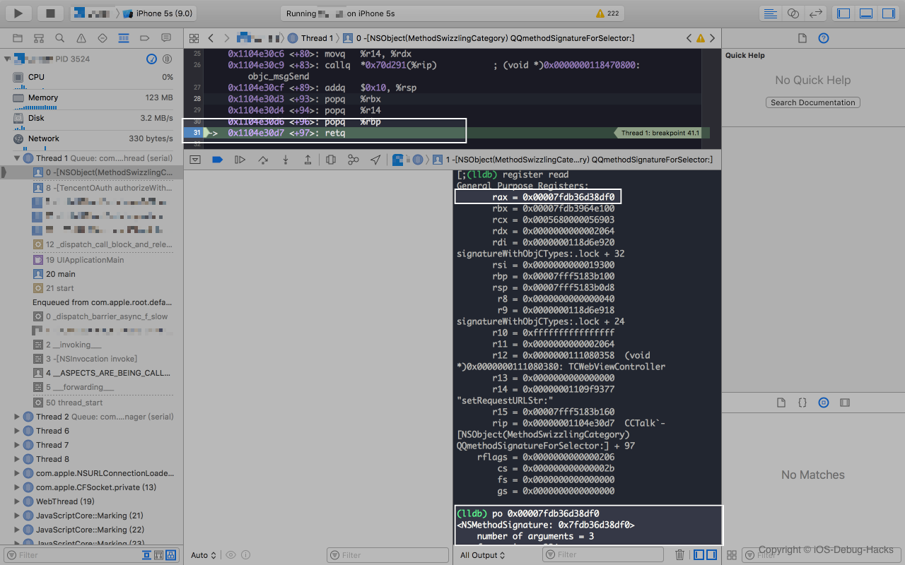

</p>

图中在方法返回的时候，将 `rax` 寄存器存放的内存地址 `0x00007fdb36d38df0` 打印出来的结果是一个 `NSMethodSignature` 对象，熟悉 X86 汇编语言调用约定的读者应该知道在 X86 汇编中，函数的返回值存放在 `rax` 寄存器中。结果表明腾讯的 `QQmethodSignatureForSelector` 方法正确被调用了，并且有返回值。所以排除了这一步出现问题。

#### forwardInvocation

使用 LLDB 给 `QQforwardInvocation` 方法下断点

```
br s -n "-[NSObject QQforwardInvocation:]"
```

断点成功添加后，继续运行后，此时应用会崩溃，没有执行 `QQforwardInvocation` 方法，所以基本能够断定是我们项目中覆盖了腾讯 Hook 的 `QQforwardInvocation` 方法。

<p align="center">

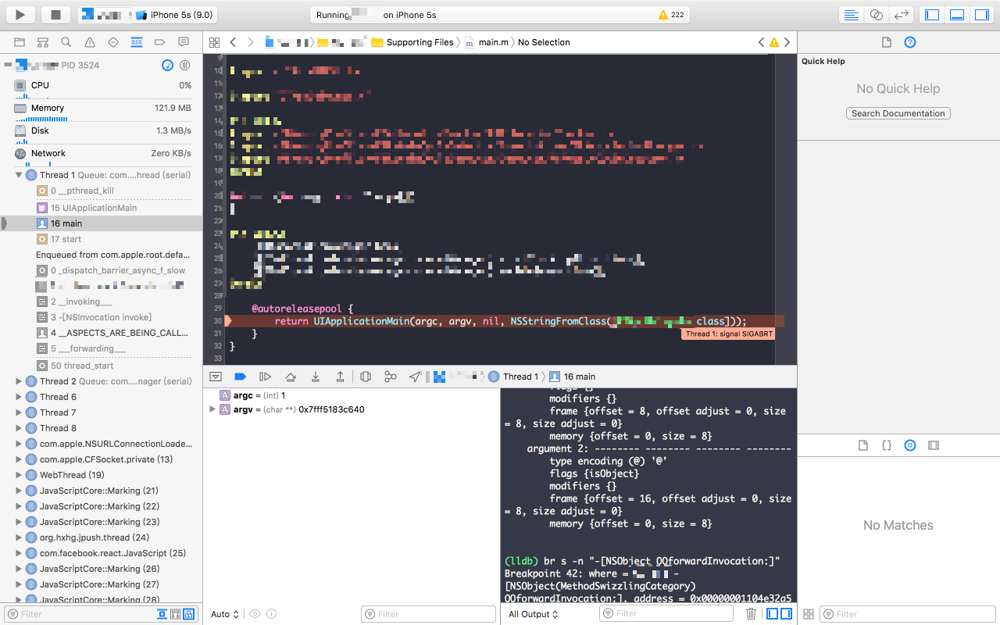

</p>

`___forwarding___` 函数包含了消息转发的完整实现，反编译的代码摘自[Objective-C 消息发送与转发机制原理](http://yulingtianxia.com/blog/2016/06/15/Objective-C-Message-Sending-and-Forwarding/)一文，文中反编译代码中调用 `forwardingTargetForSelector` 时判断 forwarding 和 receiver 是否相等处应该写错了，应当是判断 forwardingTarget 和 receiver 是否相等，代码如下：

```
int __forwarding__(void *frameStackPointer, int isStret) {
  id receiver = *(id *)frameStackPointer;
  SEL sel = *(SEL *)(frameStackPointer + 8);
  const char *selName = sel_getName(sel);
  Class receiverClass = object_getClass(receiver);

  // 调用 forwardingTargetForSelector:
  if (class_respondsToSelector(receiverClass, @selector(forwardingTargetForSelector:))) {
    id forwardingTarget = [receiver forwardingTargetForSelector:sel];
    if (forwardingTarget && forwardingTarget != receiver) {
    	if (isStret == 1) {
    		int ret;
    		objc_msgSend_stret(&ret,forwardingTarget, sel, ...);
    		return ret;
    	}
      return objc_msgSend(forwardingTarget, sel, ...);
    }
  }

  // 僵尸对象
  const char *className = class_getName(receiverClass);
  const char *zombiePrefix = "_NSZombie_";
  size_t prefixLen = strlen(zombiePrefix); // 0xa
  if (strncmp(className, zombiePrefix, prefixLen) == 0) {
    CFLog(kCFLogLevelError,
          @"*** -[%s %s]: message sent to deallocated instance %p",
          className + prefixLen,
          selName,
          receiver);
    <breakpoint-interrupt>
  }

  // 调用 methodSignatureForSelector 获取方法签名后再调用 forwardInvocation
  if (class_respondsToSelector(receiverClass, @selector(methodSignatureForSelector:))) {
    NSMethodSignature *methodSignature = [receiver methodSignatureForSelector:sel];
    if (methodSignature) {
      BOOL signatureIsStret = [methodSignature _frameDescriptor]->returnArgInfo.flags.isStruct;
      if (signatureIsStret != isStret) {
        CFLog(kCFLogLevelWarning ,
              @"*** NSForwarding: warning: method signature and compiler disagree on struct-return-edness of '%s'.  Signature thinks it does%s return a struct, and compiler thinks it does%s.",
              selName,
              signatureIsStret ? "" : not,
              isStret ? "" : not);
      }
      if (class_respondsToSelector(receiverClass, @selector(forwardInvocation:))) {
        NSInvocation *invocation = [NSInvocation _invocationWithMethodSignature:methodSignature frame:frameStackPointer];

        [receiver forwardInvocation:invocation];

        void *returnValue = NULL;
        [invocation getReturnValue:&value];
        return returnValue;
      } else {
        CFLog(kCFLogLevelWarning ,
              @"*** NSForwarding: warning: object %p of class '%s' does not implement forwardInvocation: -- dropping message",
              receiver,
              className);
        return 0;
      }
    }
  }

  SEL *registeredSel = sel_getUid(selName);

  // selector 是否已经在 Runtime 注册过
  if (sel != registeredSel) {
    CFLog(kCFLogLevelWarning ,
          @"*** NSForwarding: warning: selector (%p) for message '%s' does not match selector known to Objective C runtime (%p)-- abort",
          sel,
          selName,
          registeredSel);
  } // doesNotRecognizeSelector
  else if (class_respondsToSelector(receiverClass,@selector(doesNotRecognizeSelector:))) {
    [receiver doesNotRecognizeSelector:sel];
  } 
  else {
    CFLog(kCFLogLevelWarning ,
          @"*** NSForwarding: warning: object %p of class '%s' does not implement doesNotRecognizeSelector: -- abort",
          receiver,
          className);
  }

  // The point of no return.
  kill(getpid(), 9);
}
```

通过阅读反编译代码，基本能将消息转发的流程梳理清楚，首先是调用消息转发流程中的 `forwardingTargetForSelector` 方法获取备援接收者，也就是上文说的 Fast Forwarding 阶段，从代码中可以看出如果 `forwardingTarget` 返回空，或者和 `receiver` 相同，则进入 Regular Forwarding 阶段，具体来说就是先调用 
`methodSignatureForSelector` 拿到方法签名，然后使用前面获取到的方法签名对象和 `frameStackPointer` 实例化 `invocation` 对象，调用 `receiver` 的 `forwardInvocation:` 方法，并将刚才实例化的 `invocation` 对象传入。最后如果没有实现 `methodSignatureForSelector` 方法并且 `selector` 已经在 Runtime 注册过了，则调用 `doesNotRecognizeSelector:` 以抛出异常。

观察我们项目中崩溃堆栈中的 `___forwarding___`，会发现他的执行路径是第二步，也就是调用了 `forwardInvocation` 执行 `NSInvocation` 对象。

> 也可以在断点之后逐步执行命令，观察汇编代码的执行路径，得出结论与上面应该是一致的。

<p align="center">

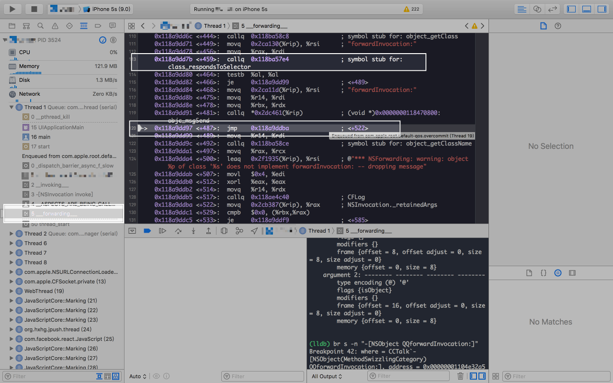

</p>

然而调用 `forwardInvocation` 方法究竟执行了哪个方法呢？从堆栈中我们可以看到 `__ASPECTS_ARE_BEING_CALLED__` 方法，这个是 `Aspects` 库 Hook `forwardInvocation` 的方法。

```objective-c
static void aspect_swizzleForwardInvocation(Class klass) {
    NSCParameterAssert(klass);
    // If there is no method, replace will act like class_addMethod.
    IMP originalImplementation = class_replaceMethod(klass, @selector(forwardInvocation:), (IMP)__ASPECTS_ARE_BEING_CALLED__, "v@:@");
    
    if (originalImplementation) {
        class_addMethod(klass, NSSelectorFromString(AspectsForwardInvocationSelectorName), originalImplementation, "v@:@");
    }
    AspectLog(@"Aspects: %@ is now aspect aware.", NSStringFromClass(klass));
}
```

```objective-c
// This is the swizzled forwardInvocation: method.
static void __ASPECTS_ARE_BEING_CALLED__(__unsafe_unretained NSObject *self, SEL selector, NSInvocation *invocation) {
    NSLog(@"selector:%@",  NSStringFromSelector(invocation.selector));
    NSCParameterAssert(self);
    NSCParameterAssert(invocation);
    SEL originalSelector = invocation.selector;
	SEL aliasSelector = aspect_aliasForSelector(invocation.selector);
    invocation.selector = aliasSelector;
    AspectsContainer *objectContainer = objc_getAssociatedObject(self, aliasSelector);
    AspectsContainer *classContainer = aspect_getContainerForClass(object_getClass(self), aliasSelector);
    AspectInfo *info = [[AspectInfo alloc] initWithInstance:self invocation:invocation];
    NSArray *aspectsToRemove = nil;

    // Before hooks.
    aspect_invoke(classContainer.beforeAspects, info);
    aspect_invoke(objectContainer.beforeAspects, info);

    // Instead hooks.
    BOOL respondsToAlias = YES;
    if (objectContainer.insteadAspects.count || classContainer.insteadAspects.count) {
        aspect_invoke(classContainer.insteadAspects, info);
        aspect_invoke(objectContainer.insteadAspects, info);
    }else {
        Class klass = object_getClass(invocation.target);
        do {
            if ((respondsToAlias = [klass instancesRespondToSelector:aliasSelector])) {
                [invocation invoke];
                break;
            }
        }while (!respondsToAlias && (klass = class_getSuperclass(klass)));
    }

    // After hooks.
    aspect_invoke(classContainer.afterAspects, info);
    aspect_invoke(objectContainer.afterAspects, info);

    // If no hooks are installed, call original implementation (usually to throw an exception)
    if (!respondsToAlias) {
        invocation.selector = originalSelector;
        SEL originalForwardInvocationSEL = NSSelectorFromString(AspectsForwardInvocationSelectorName);
        if ([self respondsToSelector:originalForwardInvocationSEL]) {
            ((void( *)(id, SEL, NSInvocation *))objc_msgSend)(self, originalForwardInvocationSEL, invocation);
        }else {
            [self doesNotRecognizeSelector:invocation.selector];
        }
    }

    // Remove any hooks that are queued for deregistration.
    [aspectsToRemove makeObjectsPerformSelector:@selector(remove)];
}
```

因为 `TCWebViewController` 是腾讯 SDK 中的私有类，猜想项目不大可能直接对其进行 Hook，很有可能是 Hook 了一个父类导致这个子类也受到影响，于是在项目中继续排查。啊哈！答案终于浮出水面。将 Hook `UIViewController` 的部分删除或者注释，此时再去使用 QQ 登录，应用不再崩溃。于是初步断定是 Aspects 库导致的。

<p align="center">

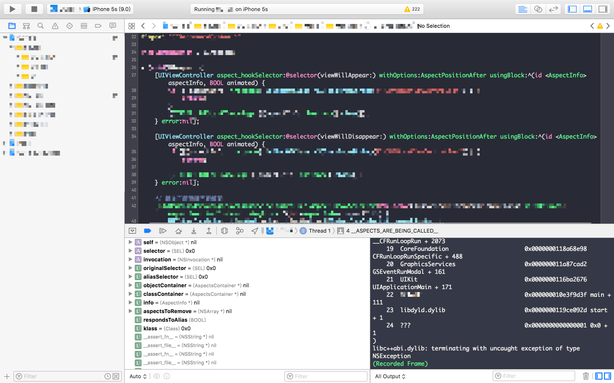

</p>

`doesNotRecognizeSelector:` 是从 `__ASPECTS_ARE_BEING_CALLED__` 方法抛出来的，`__ASPECTS_ARE_BEING_CALLED__` 是 **Aspects** 用来替换 `forwardInvocation:` 的 IMP，方法内部包含了 before、instead、after 对应时间 Aspects 切片的 hook 的逻辑。`aliasSelector` 是 **Aspects** 处理后的 SEL，如`aspects__setRequestURLStr:`。

在 Instead hooks 部分会检查 `invocation.target` 的类是否能响应 `aliasSelector`，如果子类不能响应，再检查父类是否响应，一直往上寻找直到 root，由于不能响应 `aliasSelector`，所以 `respondsToAlias` 为 false。随后，则会去将 `originalSelector` 赋值给 `invocation` 的 `selector`, 再通过 `objc_msgSend` 调用 `invocation`，企图去调用原始的 SEL，由于 `TCWebViewController` 原本就无法响应 `originalSelector`:`setRequestURLStr:`，Setter 方法本身就是在 Runtime 生成的，所以最终会运行到 `__ASPECTS_ARE_BEING_CALLED__` 方法中的 `doesNotRecognizeSelector:` 方法，也就会出现上文所述的崩溃的情况。

其实细心的读者在崩溃堆栈的第 3 行看到 `__ASPECTS_ARE_BEING_CALLED__` 时就大概猜到这个崩溃与 **Aspects** 有关系，然而上述分析的过程可以解释为什么程序会运行 `__ASPECTS_ARE_BEING_CALLED__` 方法，并且通过这个案例我们也明白了如何使用静态分析和动态调试的方法去分析没有源码的第三方库，希望文章提及的一些技巧和思想能在读者以后调试的过程中有所帮助。

#### 解决方案

要修复这个问题其实有两种思路，第一种思路，使用一种侵入性更小的 hook 方案来替换 **Aspects**，比如 Method Swizzling，这样就不会出现 **TencentOpenAPI** 生成 `Setter` 方法的消息转发流程被打断；第二种思路，**Aspects** 是直接将 `forwardInvocation:` 替换成自己实现，如果 `aliasSelector` 和 `originalSelector` 都无法响应时抛出异常，可以采取一种更合理的处理方式，如果出现上面的情况，将消息转发流程调回到原始的转发流程中，代码如下：

```objective-c
     if (!respondsToAlias) {
          invocation.selector = originalSelector;
          SEL originalForwardInvocationSEL = NSSelectorFromString(AspectsForwardInvocationSelectorName);
         ((void( *)(id, SEL, NSInvocation *))objc_msgSend)(self, originalForwardInvocationSEL, invocation);
      }
```

事实上，除了我们遇到的问题，**Aspects** 与 **JSPatch** 也存在兼容问题，由于两者的实现原理也类似，也会出现本文中遇到的 `doesNotRecognizeSelector:`，具体请阅读[微信读书的文章](http://wereadteam.github.io/2016/06/30/Aspects/)。笔者也逛了下 **Aspects** 与 **JSPatch** 的 Issues，也有与两者兼容问题相关的信息。

#### Aspects 与 TencentOpenAPI 的一次完美邂逅

导致崩溃的原因是 **Aspects** 与 **TencentOpenAPI** 两个库的一次完美邂逅。项目中使用 Aspects 库 Hook `UIViewController` 类的页面生命周期方法，Aspects 的 Hook 实现会替换掉 `forwardInvocation` 方法，由于 `TCWebViewController` 的父类是 `UIViewController`，所以也会被 Hook 住，`QQforwardInvocation` 方法被覆盖，导致消息转发失败，从而无法动态生成属性的 Setter 和 Getter 方法。

上面案例给了我们一个警示，在使用一个第三方框架和技术的时候，我们不应该只停留在会用的层面上，而是要深入了解他背后的工作原理。这样定位问题时才会事半功倍。

## 总结

文章花了比较多的篇幅介绍了各种技巧，但是比起这些花哨的技巧，更希望读者能掌握良好的调试思想，因为良好的思维不是一朝一夕能养成的，而技巧通常都能现学现卖。只有具备良好的解决问题的思路，再辅以各种调试技巧，那么问题就迎刃而解了。


## 参考资料

* 《代码大全》
* 《深入理解计算机系统》
* 《调试九法:软硬件错误的排查之道》
* 《Advanced Apple Debugging & Reverse Engineering》
* 《64 Bit Intel Assembly Language Programming for Linux》
* 《Debug It!: Find, Repair, and Prevent Bugs in Your Code》
* 《Effective Objective-C 2.0：编写高质量iOS与OS X代码的52个有效方法》
* [Objective-C 消息发送与转发机制原理](http://yulingtianxia.com/blog/2016/06/15/Objective-C-Message-Sending-and-Forwarding/)

## 作者

* [Alex Ao](https://github.com/aozhimin)
* [NewDu](https://github.com/NewDu)

## 致谢

特别致谢以下读者，感谢他们对文章的支持，并提出了非常宝贵的建议。

* [ZenonHuang](https://github.com/ZenonHuang)
